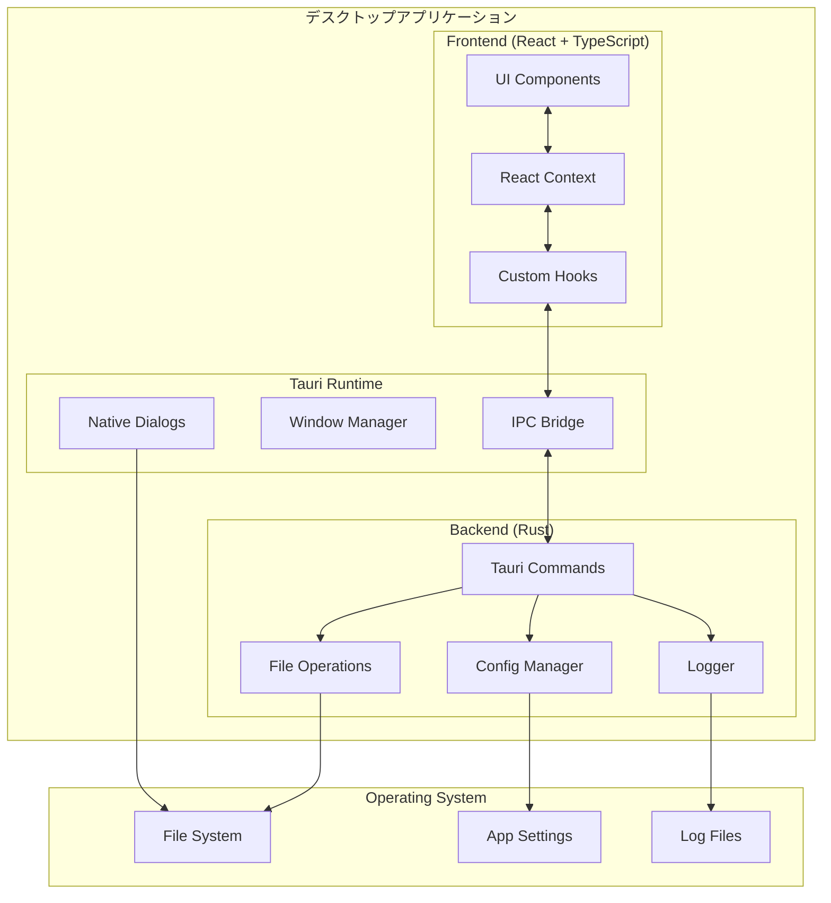
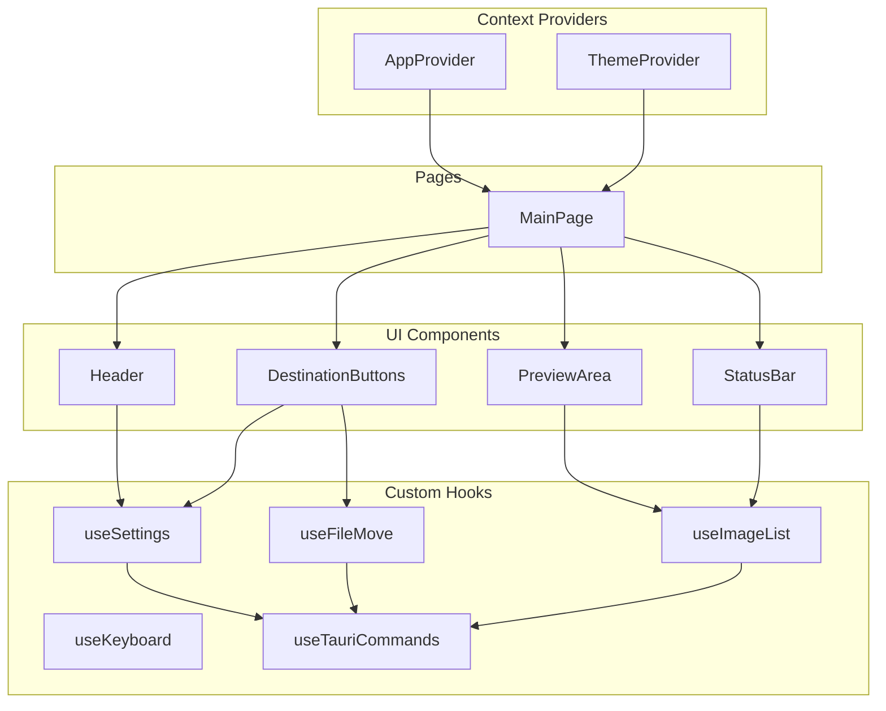
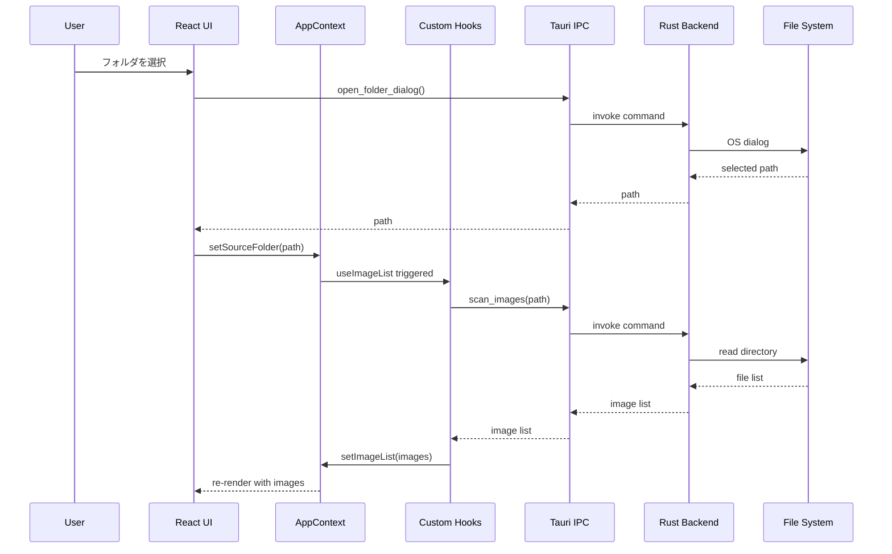
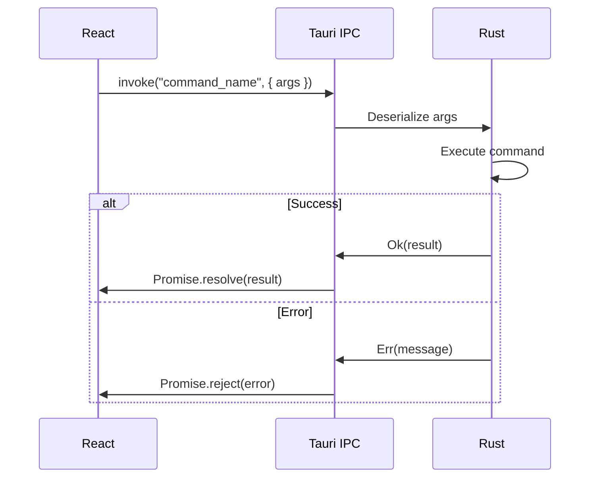

# 技術アーキテクチャ

このドキュメントでは、画像仕分けアプリのシステム構成、コンポーネント設計、データフローを定義する。

## 1. システム構成図



## 2. コンポーネント関係図



## 3. データフロー図



## 4. ディレクトリ構造

```
picSort/
├── src/                          # Reactソースコード
│   ├── components/               # UIコンポーネント
│   │   ├── Header/
│   │   │   ├── Header.tsx
│   │   │   ├── FolderSelectButton.tsx
│   │   │   ├── PathDisplay.tsx
│   │   │   └── index.ts
│   │   ├── DestinationButtons/
│   │   │   ├── DestinationButtons.tsx
│   │   │   ├── DestButton.tsx
│   │   │   └── index.ts
│   │   ├── PreviewArea/
│   │   │   ├── PreviewArea.tsx
│   │   │   ├── ImageViewer.tsx
│   │   │   ├── EmptyState.tsx
│   │   │   ├── DropZone.tsx
│   │   │   └── index.ts
│   │   └── StatusBar/
│   │       ├── StatusBar.tsx
│   │       └── index.ts
│   ├── contexts/                 # React Context
│   │   ├── AppContext.tsx
│   │   └── ThemeContext.tsx
│   ├── hooks/                    # Custom Hooks
│   │   ├── useImageList.ts
│   │   ├── useFileMove.ts
│   │   ├── useKeyboard.ts
│   │   ├── useSettings.ts
│   │   └── useTauriCommands.ts
│   ├── types/                    # TypeScript型定義
│   │   ├── image.ts
│   │   ├── settings.ts
│   │   └── index.ts
│   ├── utils/                    # ユーティリティ
│   │   ├── path.ts
│   │   └── format.ts
│   ├── i18n/                     # 国際化
│   │   ├── ja.json
│   │   └── en.json
│   ├── styles/                   # グローバルスタイル
│   │   ├── globals.css
│   │   └── themes.css
│   ├── App.tsx
│   ├── main.tsx
│   └── vite-env.d.ts
├── src-tauri/                    # Rustソースコード
│   ├── src/
│   │   ├── commands/             # Tauriコマンド
│   │   │   ├── mod.rs
│   │   │   ├── file_ops.rs
│   │   │   ├── dialog.rs
│   │   │   └── config.rs
│   │   ├── utils/                # ユーティリティ
│   │   │   ├── mod.rs
│   │   │   └── path.rs
│   │   ├── config/               # 設定管理
│   │   │   ├── mod.rs
│   │   │   └── settings.rs
│   │   ├── logger/               # ログ管理
│   │   │   └── mod.rs
│   │   ├── lib.rs
│   │   └── main.rs
│   ├── Cargo.toml
│   ├── tauri.conf.json
│   └── icons/
├── public/                       # 静的ファイル
├── docs/                         # ドキュメント
├── tests/                        # テスト
│   ├── unit/
│   └── e2e/
├── package.json
├── tsconfig.json
├── vite.config.ts
└── README.md
```

## 5. Rust Backend

### 5.1 Tauriコマンド一覧

| コマンド | 引数 | 戻り値 | 説明 |
|---------|------|--------|------|
| `open_folder_dialog` | `title: String` | `Option<String>` | フォルダ選択ダイアログ表示 |
| `scan_images` | `path: String` | `Result<Vec<ImageInfo>>` | フォルダ内画像をスキャン |
| `move_file` | `src: String, dest: String` | `Result<String>` | ファイル移動（連番対応） |
| `read_image` | `path: String` | `Result<Vec<u8>>` | 画像バイナリ読み込み |
| `load_settings` | - | `Result<Settings>` | 設定読み込み |
| `save_settings` | `settings: Settings` | `Result<()>` | 設定保存 |
| `get_app_dir` | - | `String` | アプリデータディレクトリ取得 |

### 5.2 コマンド定義例

```rust
// src-tauri/src/commands/file_ops.rs

use tauri::command;
use std::path::Path;
use std::fs;

#[derive(serde::Serialize)]
pub struct ImageInfo {
    pub path: String,
    pub name: String,
    pub size: u64,
    pub modified_at: u64,
}

#[command]
pub fn scan_images(path: String) -> Result<Vec<ImageInfo>, String> {
    let dir = Path::new(&path);
    if !dir.is_dir() {
        return Err("Not a directory".to_string());
    }

    let mut images = Vec::new();
    let extensions = ["jpg", "jpeg", "png", "gif", "bmp", "webp"];

    for entry in fs::read_dir(dir).map_err(|e| e.to_string())? {
        let entry = entry.map_err(|e| e.to_string())?;
        let path = entry.path();

        if let Some(ext) = path.extension() {
            let ext_lower = ext.to_string_lossy().to_lowercase();
            if extensions.contains(&ext_lower.as_str()) {
                let metadata = entry.metadata().map_err(|e| e.to_string())?;
                images.push(ImageInfo {
                    path: path.to_string_lossy().to_string(),
                    name: entry.file_name().to_string_lossy().to_string(),
                    size: metadata.len(),
                    modified_at: metadata.modified()
                        .ok()
                        .and_then(|t| t.duration_since(std::time::UNIX_EPOCH).ok())
                        .map(|d| d.as_secs())
                        .unwrap_or(0),
                });
            }
        }
    }

    // 自然順ソート
    images.sort_by(|a, b| natord::compare(&a.name, &b.name));
    Ok(images)
}

#[command]
pub fn move_file(src: String, dest_folder: String) -> Result<String, String> {
    let src_path = Path::new(&src);
    if !src_path.exists() {
        return Err("Source file not found".to_string());
    }

    let file_name = src_path.file_name()
        .ok_or("Invalid file name")?
        .to_string_lossy()
        .to_string();

    let dest_path = generate_unique_path(&dest_folder, &file_name)?;

    fs::rename(&src, &dest_path).map_err(|e| e.to_string())?;

    Ok(dest_path)
}

fn generate_unique_path(folder: &str, file_name: &str) -> Result<String, String> {
    let base_path = Path::new(folder).join(file_name);
    if !base_path.exists() {
        return Ok(base_path.to_string_lossy().to_string());
    }

    let stem = Path::new(file_name)
        .file_stem()
        .map(|s| s.to_string_lossy().to_string())
        .unwrap_or_default();
    let ext = Path::new(file_name)
        .extension()
        .map(|s| format!(".{}", s.to_string_lossy()))
        .unwrap_or_default();

    for i in 1..1000 {
        let new_name = format!("{}_{}{}", stem, i, ext);
        let new_path = Path::new(folder).join(&new_name);
        if !new_path.exists() {
            return Ok(new_path.to_string_lossy().to_string());
        }
    }

    Err("Could not generate unique filename".to_string())
}
```

### 5.3 設定管理

```rust
// src-tauri/src/config/settings.rs

use serde::{Deserialize, Serialize};
use std::collections::HashMap;

#[derive(Debug, Serialize, Deserialize, Default)]
pub struct Settings {
    pub destinations: HashMap<String, Option<String>>,
    pub theme: Theme,
    pub language: String,
    pub window: WindowSettings,
}

#[derive(Debug, Serialize, Deserialize, Default)]
pub enum Theme {
    #[default]
    System,
    Light,
    Dark,
}

#[derive(Debug, Serialize, Deserialize, Default)]
pub struct WindowSettings {
    pub width: u32,
    pub height: u32,
    pub x: Option<i32>,
    pub y: Option<i32>,
}
```

## 6. React Frontend

### 6.1 Context設計

```typescript
// src/contexts/AppContext.tsx

import { createContext, useContext, useReducer, ReactNode } from 'react';

interface ImageInfo {
  path: string;
  name: string;
  size: number;
  modifiedAt: number;
}

interface AppState {
  sourceFolder: string | null;
  images: ImageInfo[];
  currentIndex: number;
  destinations: Record<string, string | null>;
  status: 'idle' | 'loading' | 'error';
  statusMessage: string;
}

type AppAction =
  | { type: 'SET_SOURCE_FOLDER'; payload: string }
  | { type: 'SET_IMAGES'; payload: ImageInfo[] }
  | { type: 'SET_CURRENT_INDEX'; payload: number }
  | { type: 'REMOVE_CURRENT_IMAGE' }
  | { type: 'SET_DESTINATION'; payload: { key: string; path: string | null } }
  | { type: 'SET_STATUS'; payload: { status: AppState['status']; message?: string } };

const initialState: AppState = {
  sourceFolder: null,
  images: [],
  currentIndex: 0,
  destinations: { '1': null, '2': null, '3': null, '4': null, '5': null },
  status: 'idle',
  statusMessage: '',
};

function appReducer(state: AppState, action: AppAction): AppState {
  switch (action.type) {
    case 'SET_SOURCE_FOLDER':
      return { ...state, sourceFolder: action.payload, images: [], currentIndex: 0 };
    case 'SET_IMAGES':
      return { ...state, images: action.payload, currentIndex: 0 };
    case 'SET_CURRENT_INDEX':
      return { ...state, currentIndex: action.payload };
    case 'REMOVE_CURRENT_IMAGE': {
      const newImages = state.images.filter((_, i) => i !== state.currentIndex);
      const newIndex = Math.min(state.currentIndex, newImages.length - 1);
      return { ...state, images: newImages, currentIndex: Math.max(0, newIndex) };
    }
    case 'SET_DESTINATION':
      return {
        ...state,
        destinations: { ...state.destinations, [action.payload.key]: action.payload.path },
      };
    case 'SET_STATUS':
      return {
        ...state,
        status: action.payload.status,
        statusMessage: action.payload.message || '',
      };
    default:
      return state;
  }
}

const AppContext = createContext<{
  state: AppState;
  dispatch: React.Dispatch<AppAction>;
} | null>(null);

export function AppProvider({ children }: { children: ReactNode }) {
  const [state, dispatch] = useReducer(appReducer, initialState);
  return (
    <AppContext.Provider value={{ state, dispatch }}>
      {children}
    </AppContext.Provider>
  );
}

export function useApp() {
  const context = useContext(AppContext);
  if (!context) {
    throw new Error('useApp must be used within AppProvider');
  }
  return context;
}
```

### 6.2 Custom Hooks

```typescript
// src/hooks/useTauriCommands.ts

import { invoke } from '@tauri-apps/api/core';

interface ImageInfo {
  path: string;
  name: string;
  size: number;
  modified_at: number;
}

export function useTauriCommands() {
  const openFolderDialog = async (title: string): Promise<string | null> => {
    return await invoke<string | null>('open_folder_dialog', { title });
  };

  const scanImages = async (path: string): Promise<ImageInfo[]> => {
    return await invoke<ImageInfo[]>('scan_images', { path });
  };

  const moveFile = async (src: string, destFolder: string): Promise<string> => {
    return await invoke<string>('move_file', { src, destFolder });
  };

  return {
    openFolderDialog,
    scanImages,
    moveFile,
  };
}
```

```typescript
// src/hooks/useKeyboard.ts

import { useEffect, useCallback } from 'react';
import { useApp } from '../contexts/AppContext';

export function useKeyboard() {
  const { state, dispatch } = useApp();

  const handleKeyDown = useCallback((event: KeyboardEvent) => {
    // 入力フィールドにフォーカスがある場合は無視
    if (
      event.target instanceof HTMLInputElement ||
      event.target instanceof HTMLTextAreaElement
    ) {
      return;
    }

    const key = event.key;

    // 数字キー（1-5）: 仕分け
    if (['1', '2', '3', '4', '5'].includes(key)) {
      const dest = state.destinations[key];
      if (!dest) {
        dispatch({
          type: 'SET_STATUS',
          payload: { status: 'error', message: `分別先${key}を設定してください` },
        });
        return;
      }
      // 移動処理をトリガー（別途実装）
      return;
    }

    // 矢印キー: 画像移動
    if (key === 'ArrowLeft' || key === 'a' || key === 'A') {
      if (state.currentIndex > 0) {
        dispatch({ type: 'SET_CURRENT_INDEX', payload: state.currentIndex - 1 });
      }
      return;
    }

    if (key === 'ArrowRight' || key === 'd' || key === 'D' || key === ' ') {
      if (state.currentIndex < state.images.length - 1) {
        dispatch({ type: 'SET_CURRENT_INDEX', payload: state.currentIndex + 1 });
      }
      return;
    }
  }, [state, dispatch]);

  useEffect(() => {
    window.addEventListener('keydown', handleKeyDown);
    return () => {
      window.removeEventListener('keydown', handleKeyDown);
    };
  }, [handleKeyDown]);
}
```

### 6.3 Tauriコマンド呼び出しパターン

```typescript
// 推奨パターン: エラーハンドリング付き

import { useCallback, useState } from 'react';
import { useTauriCommands } from './useTauriCommands';
import { useApp } from '../contexts/AppContext';

export function useFileMove() {
  const { moveFile } = useTauriCommands();
  const { state, dispatch } = useApp();
  const [isMoving, setIsMoving] = useState(false);

  const moveCurrentImage = useCallback(async (destKey: string) => {
    const destFolder = state.destinations[destKey];
    if (!destFolder) {
      dispatch({
        type: 'SET_STATUS',
        payload: { status: 'error', message: `分別先${destKey}を設定してください` },
      });
      return false;
    }

    const currentImage = state.images[state.currentIndex];
    if (!currentImage) {
      return false;
    }

    setIsMoving(true);
    dispatch({
      type: 'SET_STATUS',
      payload: { status: 'loading', message: '移動中...' },
    });

    try {
      await moveFile(currentImage.path, destFolder);
      dispatch({ type: 'REMOVE_CURRENT_IMAGE' });
      dispatch({
        type: 'SET_STATUS',
        payload: { status: 'idle', message: `移動完了: ${destFolder}` },
      });
      return true;
    } catch (error) {
      dispatch({
        type: 'SET_STATUS',
        payload: { status: 'error', message: `移動失敗: ${error}` },
      });
      return false;
    } finally {
      setIsMoving(false);
    }
  }, [state, dispatch, moveFile]);

  return { moveCurrentImage, isMoving };
}
```

## 7. 型定義

```typescript
// src/types/index.ts

export interface ImageInfo {
  path: string;
  name: string;
  size: number;
  modifiedAt: number;
}

export interface Settings {
  destinations: Record<string, string | null>;
  theme: 'system' | 'light' | 'dark';
  language: 'ja' | 'en';
  window: WindowSettings;
}

export interface WindowSettings {
  width: number;
  height: number;
  x?: number;
  y?: number;
}

export type Status = 'idle' | 'loading' | 'error';

export interface StatusInfo {
  status: Status;
  message: string;
}
```

## 8. 通信プロトコル

### 8.1 Tauri IPC



### 8.2 エラー伝播

| レイヤー | エラー形式 | 例 |
|---------|-----------|-----|
| Rust | `Result<T, String>` | `Err("File not found".to_string())` |
| Tauri IPC | JavaScript Error | `{ message: "File not found" }` |
| React Hook | throw Error | `throw new Error("File not found")` |
| UI | statusMessage | ステータスバーに表示 |
