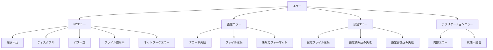
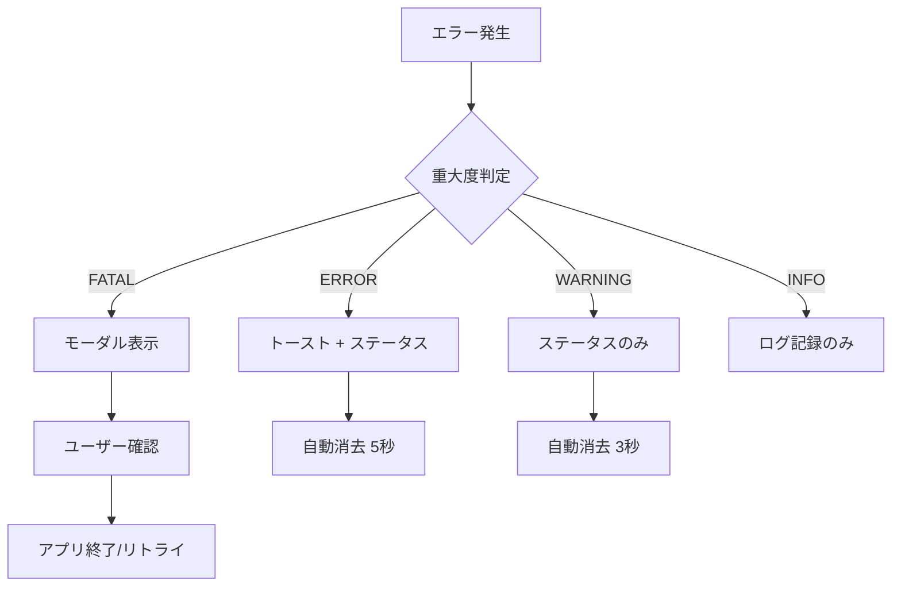

# エラー処理・例外仕様

このドキュメントでは、画像仕分けアプリのエラー処理方針、エラーコード体系、ログ出力形式を定義する。

## 1. エラー分類

### 1.1 エラーカテゴリ



### 1.2 エラー重大度

| レベル | 説明 | 動作 |
|--------|------|------|
| `FATAL` | アプリ続行不可 | エラー表示後、アプリ終了 |
| `ERROR` | 操作失敗 | エラー表示、操作中止 |
| `WARNING` | 警告 | 警告表示、操作続行可能 |
| `INFO` | 情報 | ログのみ、ユーザー通知なし |

## 2. エラーコード体系

### 2.1 コード形式

```
E-[カテゴリ]-[番号]
```

| カテゴリ | コード |
|---------|--------|
| I/O | `IO` |
| 画像 | `IMG` |
| 設定 | `CFG` |
| アプリ | `APP` |

### 2.2 エラーコード一覧

#### I/Oエラー

| コード | 名称 | 説明 | 重大度 |
|--------|------|------|--------|
| `E-IO-001` | PERMISSION_DENIED | 読み取り/書き込み権限がありません | ERROR |
| `E-IO-002` | DISK_FULL | ディスク容量が不足しています | ERROR |
| `E-IO-003` | PATH_NOT_FOUND | 指定されたパスが見つかりません | ERROR |
| `E-IO-004` | PATH_INVALID | パス形式が不正です | ERROR |
| `E-IO-005` | FILE_IN_USE | ファイルが他のプログラムで使用中です | ERROR |
| `E-IO-006` | NETWORK_ERROR | ネットワークエラーが発生しました | ERROR |
| `E-IO-007` | FILE_NOT_FOUND | ファイルが見つかりません | ERROR |
| `E-IO-008` | DIRECTORY_NOT_EMPTY | ディレクトリが空ではありません | WARNING |
| `E-IO-009` | RENAME_FAILED | ファイル名の変更に失敗しました | ERROR |
| `E-IO-010` | COPY_FAILED | ファイルのコピーに失敗しました | ERROR |

#### 画像エラー

| コード | 名称 | 説明 | 重大度 |
|--------|------|------|--------|
| `E-IMG-001` | DECODE_FAILED | 画像のデコードに失敗しました | WARNING |
| `E-IMG-002` | FILE_CORRUPTED | 画像ファイルが破損しています | WARNING |
| `E-IMG-003` | UNSUPPORTED_FORMAT | 未対応の画像形式です | INFO |
| `E-IMG-004` | LOAD_TIMEOUT | 画像の読み込みがタイムアウトしました | WARNING |
| `E-IMG-005` | MEMORY_EXCEEDED | 画像が大きすぎてメモリ不足です | ERROR |

#### 設定エラー

| コード | 名称 | 説明 | 重大度 |
|--------|------|------|--------|
| `E-CFG-001` | CONFIG_CORRUPTED | 設定ファイルが破損しています | WARNING |
| `E-CFG-002` | CONFIG_READ_FAILED | 設定の読み込みに失敗しました | WARNING |
| `E-CFG-003` | CONFIG_WRITE_FAILED | 設定の保存に失敗しました | ERROR |
| `E-CFG-004` | CONFIG_INVALID | 設定値が不正です | WARNING |

#### アプリケーションエラー

| コード | 名称 | 説明 | 重大度 |
|--------|------|------|--------|
| `E-APP-001` | INTERNAL_ERROR | 内部エラーが発生しました | FATAL |
| `E-APP-002` | STATE_INVALID | 状態が不整合です | ERROR |
| `E-APP-003` | IPC_FAILED | バックエンドとの通信に失敗しました | ERROR |
| `E-APP-004` | COMMAND_FAILED | コマンドの実行に失敗しました | ERROR |

## 3. エラー型定義

### 3.1 Rust側

```rust
// src-tauri/src/error.rs

use serde::{Deserialize, Serialize};
use thiserror::Error;

#[derive(Debug, Error, Serialize, Deserialize)]
pub enum AppError {
    // I/O Errors
    #[error("E-IO-001: Permission denied: {0}")]
    PermissionDenied(String),

    #[error("E-IO-002: Disk full")]
    DiskFull,

    #[error("E-IO-003: Path not found: {0}")]
    PathNotFound(String),

    #[error("E-IO-004: Invalid path: {0}")]
    PathInvalid(String),

    #[error("E-IO-005: File in use: {0}")]
    FileInUse(String),

    #[error("E-IO-006: Network error: {0}")]
    NetworkError(String),

    #[error("E-IO-007: File not found: {0}")]
    FileNotFound(String),

    // Image Errors
    #[error("E-IMG-001: Decode failed: {0}")]
    DecodeFailed(String),

    #[error("E-IMG-002: File corrupted: {0}")]
    FileCorrupted(String),

    #[error("E-IMG-003: Unsupported format: {0}")]
    UnsupportedFormat(String),

    // Config Errors
    #[error("E-CFG-001: Config corrupted")]
    ConfigCorrupted,

    #[error("E-CFG-002: Config read failed: {0}")]
    ConfigReadFailed(String),

    #[error("E-CFG-003: Config write failed: {0}")]
    ConfigWriteFailed(String),

    // App Errors
    #[error("E-APP-001: Internal error: {0}")]
    InternalError(String),

    #[error("E-APP-002: Invalid state: {0}")]
    InvalidState(String),
}

impl From<std::io::Error> for AppError {
    fn from(err: std::io::Error) -> Self {
        match err.kind() {
            std::io::ErrorKind::NotFound => AppError::FileNotFound(err.to_string()),
            std::io::ErrorKind::PermissionDenied => AppError::PermissionDenied(err.to_string()),
            std::io::ErrorKind::AlreadyExists => AppError::FileInUse(err.to_string()),
            _ => AppError::InternalError(err.to_string()),
        }
    }
}
```

### 3.2 TypeScript側

```typescript
// src/types/error.ts

export interface AppError {
  code: string;
  message: string;
  details?: string;
}

export const ErrorCode = {
  // I/O Errors
  PERMISSION_DENIED: 'E-IO-001',
  DISK_FULL: 'E-IO-002',
  PATH_NOT_FOUND: 'E-IO-003',
  PATH_INVALID: 'E-IO-004',
  FILE_IN_USE: 'E-IO-005',
  NETWORK_ERROR: 'E-IO-006',
  FILE_NOT_FOUND: 'E-IO-007',

  // Image Errors
  DECODE_FAILED: 'E-IMG-001',
  FILE_CORRUPTED: 'E-IMG-002',
  UNSUPPORTED_FORMAT: 'E-IMG-003',
  LOAD_TIMEOUT: 'E-IMG-004',
  MEMORY_EXCEEDED: 'E-IMG-005',

  // Config Errors
  CONFIG_CORRUPTED: 'E-CFG-001',
  CONFIG_READ_FAILED: 'E-CFG-002',
  CONFIG_WRITE_FAILED: 'E-CFG-003',

  // App Errors
  INTERNAL_ERROR: 'E-APP-001',
  STATE_INVALID: 'E-APP-002',
  IPC_FAILED: 'E-APP-003',
} as const;

export function parseError(error: unknown): AppError {
  if (typeof error === 'string') {
    const match = error.match(/^(E-\w+-\d+):\s*(.+)$/);
    if (match) {
      return { code: match[1], message: match[2] };
    }
    return { code: ErrorCode.INTERNAL_ERROR, message: error };
  }

  if (error instanceof Error) {
    return { code: ErrorCode.INTERNAL_ERROR, message: error.message };
  }

  return { code: ErrorCode.INTERNAL_ERROR, message: 'Unknown error' };
}
```

## 4. ユーザーへの表示方針

### 4.1 表示レベル

| レベル | 表示方法 | 表示時間 |
|--------|---------|---------|
| FATAL | モーダルダイアログ | ユーザー確認まで |
| ERROR | ステータスバー + トースト | 5秒 |
| WARNING | ステータスバー | 3秒 |
| INFO | なし（ログのみ） | - |

### 4.2 エラーメッセージ表示



### 4.3 メッセージローカライズ

```json
// src/i18n/ja.json
{
  "errors": {
    "E-IO-001": "アクセス権限がありません",
    "E-IO-002": "ディスク容量が不足しています",
    "E-IO-003": "指定されたパスが見つかりません",
    "E-IO-007": "ファイルが見つかりません",
    "E-IMG-001": "画像を読み込めませんでした",
    "E-IMG-003": "対応していない画像形式です",
    "E-CFG-001": "設定ファイルを読み込めませんでした。初期設定を使用します",
    "E-APP-001": "予期しないエラーが発生しました"
  }
}
```

### 4.4 エラー表示コンポーネント

```typescript
// src/components/ErrorDisplay.tsx

import { useEffect, useState } from 'react';
import { AppError } from '../types/error';
import { useTranslation } from '../hooks/useTranslation';

interface ErrorDisplayProps {
  error: AppError | null;
  onDismiss: () => void;
}

export function ErrorDisplay({ error, onDismiss }: ErrorDisplayProps) {
  const { t } = useTranslation();
  const [visible, setVisible] = useState(false);

  useEffect(() => {
    if (error) {
      setVisible(true);
      const timer = setTimeout(() => {
        setVisible(false);
        onDismiss();
      }, 5000);
      return () => clearTimeout(timer);
    }
  }, [error, onDismiss]);

  if (!error || !visible) return null;

  const message = t(`errors.${error.code}`) || error.message;

  return (
    <div className="error-toast" role="alert">
      <span className="error-icon">⚠</span>
      <span className="error-message">{message}</span>
      <button onClick={onDismiss} aria-label="閉じる">✕</button>
    </div>
  );
}
```

## 5. ログ出力形式

### 5.1 ログレベル

| レベル | 用途 |
|--------|------|
| `ERROR` | エラー発生時 |
| `WARN` | 警告 |
| `INFO` | 操作ログ（移動、設定変更等） |
| `DEBUG` | 開発用詳細ログ |
| `TRACE` | 詳細なトレースログ |

### 5.2 ログフォーマット

```
[YYYY-MM-DD HH:mm:ss.SSS] [LEVEL] [MODULE] MESSAGE
```

例:
```
[2025-12-20 14:30:45.123] [INFO] [file_ops] Moved: /src/photo.jpg -> /dest/photo.jpg
[2025-12-20 14:30:46.456] [ERROR] [file_ops] E-IO-001: Permission denied: /dest/readonly/
[2025-12-20 14:30:47.789] [WARN] [image] E-IMG-001: Decode failed: /src/corrupted.jpg
```

### 5.3 ログファイル管理

| 項目 | 仕様 |
|------|------|
| ファイル名 | `picsort_YYYY-MM-DD.log` |
| 保存場所 | `{app_dir}/logs/` |
| ローテーション | 日次 |
| 保持期間 | 7日間 |
| 最大サイズ | 10MB/ファイル |

### 5.4 Rust側ログ実装

```rust
// src-tauri/src/logger/mod.rs

use chrono::Local;
use log::{Level, LevelFilter, Metadata, Record};
use std::fs::{self, OpenOptions};
use std::io::Write;
use std::path::PathBuf;
use std::sync::Mutex;

pub struct FileLogger {
    log_dir: PathBuf,
    file: Mutex<Option<std::fs::File>>,
    current_date: Mutex<String>,
}

impl FileLogger {
    pub fn new(log_dir: PathBuf) -> Self {
        fs::create_dir_all(&log_dir).ok();
        Self {
            log_dir,
            file: Mutex::new(None),
            current_date: Mutex::new(String::new()),
        }
    }

    fn get_log_file(&self) -> std::io::Result<std::fs::File> {
        let today = Local::now().format("%Y-%m-%d").to_string();
        let mut current = self.current_date.lock().unwrap();

        if *current != today {
            *current = today.clone();
            let path = self.log_dir.join(format!("picsort_{}.log", today));
            let file = OpenOptions::new()
                .create(true)
                .append(true)
                .open(path)?;
            *self.file.lock().unwrap() = Some(file);
        }

        // ファイルを複製して返す
        self.file.lock().unwrap()
            .as_ref()
            .ok_or(std::io::Error::new(
                std::io::ErrorKind::NotFound,
                "Log file not initialized",
            ))
            .and_then(|f| f.try_clone())
    }
}

impl log::Log for FileLogger {
    fn enabled(&self, metadata: &Metadata) -> bool {
        metadata.level() <= Level::Info
    }

    fn log(&self, record: &Record) {
        if self.enabled(record.metadata()) {
            let timestamp = Local::now().format("%Y-%m-%d %H:%M:%S%.3f");
            let line = format!(
                "[{}] [{}] [{}] {}\n",
                timestamp,
                record.level(),
                record.target(),
                record.args()
            );

            if let Ok(mut file) = self.get_log_file() {
                let _ = file.write_all(line.as_bytes());
            }
        }
    }

    fn flush(&self) {
        if let Ok(mut file) = self.get_log_file() {
            let _ = file.flush();
        }
    }
}
```

## 6. エラーリカバリー

### 6.1 リカバリー戦略

| エラー | リカバリー方法 |
|--------|--------------|
| 画像デコード失敗 | スキップして次の画像へ |
| ファイル移動失敗 | 操作中止、元ファイル保持 |
| 設定読み込み失敗 | デフォルト設定で起動 |
| 設定保存失敗 | リトライ（3回まで） |
| ネットワークエラー | リトライ（タイムアウト付き） |

### 6.2 リトライ設定

```typescript
// src/utils/retry.ts

interface RetryConfig {
  maxAttempts: number;
  delayMs: number;
  backoffMultiplier: number;
}

const defaultConfig: RetryConfig = {
  maxAttempts: 3,
  delayMs: 1000,
  backoffMultiplier: 2,
};

export async function withRetry<T>(
  fn: () => Promise<T>,
  config: Partial<RetryConfig> = {}
): Promise<T> {
  const { maxAttempts, delayMs, backoffMultiplier } = { ...defaultConfig, ...config };

  let lastError: Error | undefined;
  let currentDelay = delayMs;

  for (let attempt = 1; attempt <= maxAttempts; attempt++) {
    try {
      return await fn();
    } catch (error) {
      lastError = error as Error;
      if (attempt < maxAttempts) {
        await new Promise(resolve => setTimeout(resolve, currentDelay));
        currentDelay *= backoffMultiplier;
      }
    }
  }

  throw lastError;
}
```

### 6.3 グレースフルデグラデーション

| 機能 | 障害時の動作 |
|------|-------------|
| 先読み失敗 | 先読みを無効化、オンデマンド読み込みに切替 |
| 設定保存失敗 | メモリ内で保持、次回起動時に再試行 |
| ログ出力失敗 | コンソールに出力 |
| テーマ読み込み失敗 | システムデフォルトテーマを使用 |
