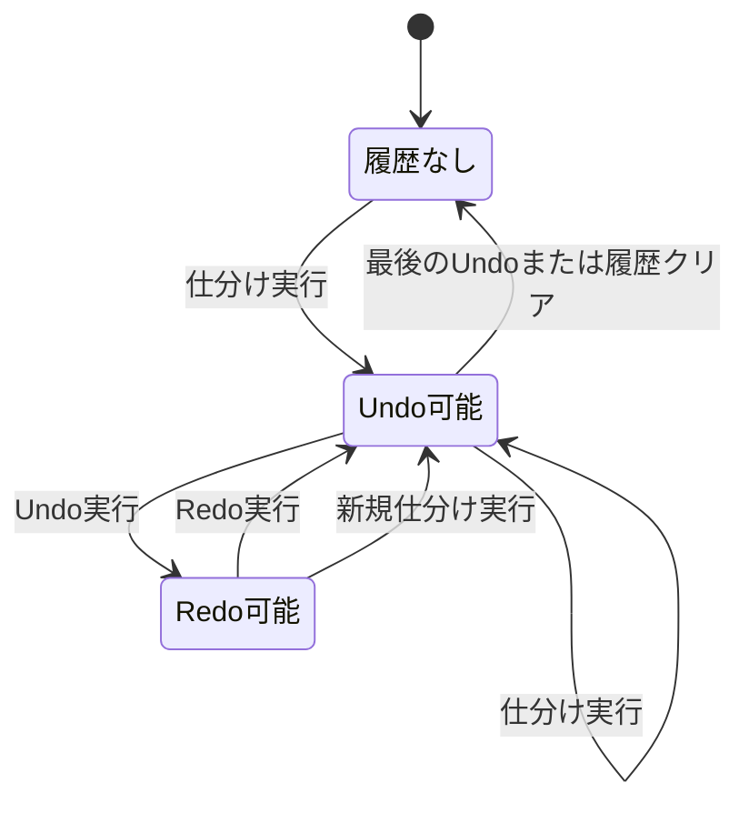
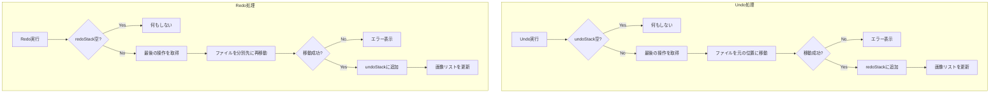
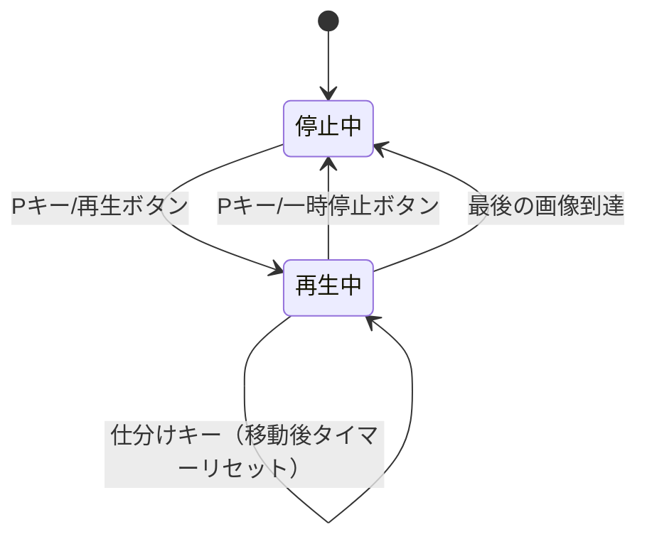
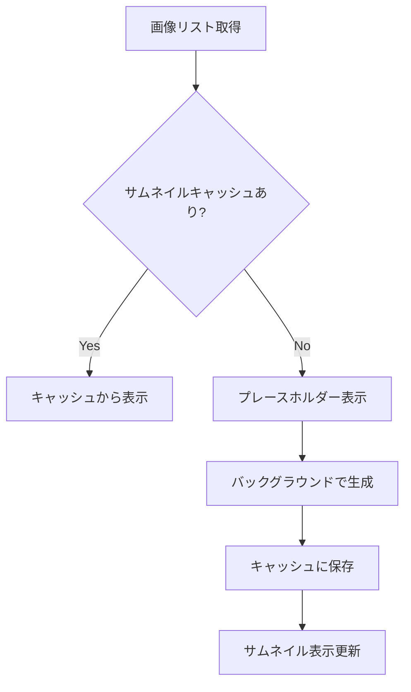
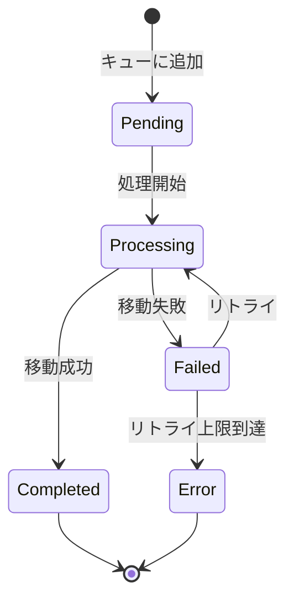

# 拡張機能詳細仕様

このドキュメントでは、画像仕分けアプリの拡張機能について詳細な仕様を定義する。

## 1. 拡張機能一覧

| 機能 | 優先度 | 複雑度 | 依存関係 |
|------|--------|--------|---------|
| Undo/Redo | 高 | 中 | なし |
| 連続自動再生モード | 中 | 低 | なし |
| サムネイル一覧モード | 中 | 高 | なし |
| Exif情報表示 | 低 | 中 | Rust exif crate |
| バックグラウンド処理キュー | 低 | 高 | なし |

---

## 2. Undo/Redo

### 2.1 概要
直前の仕分け操作を取り消し、元のフォルダに画像を戻す機能。

### 2.2 機能仕様

| 項目 | 仕様 |
|------|------|
| 履歴保持数 | 最大50件 |
| 対象操作 | ファイル移動のみ |
| 永続化 | セッション内のみ（アプリ終了でクリア） |
| キーバインド | `Ctrl+Z` (Undo), `Ctrl+Shift+Z` (Redo) |

### 2.3 状態遷移図



### 2.4 データ構造

```typescript
interface MoveOperation {
  id: string;
  timestamp: number;
  sourcePath: string;       // 移動元（分別元フォルダ内）
  destinationPath: string;  // 移動先（分別先フォルダ内の実パス）
  fileName: string;
}

interface HistoryState {
  undoStack: MoveOperation[];
  redoStack: MoveOperation[];
  maxHistory: number;
}
```

### 2.5 処理フロー



### 2.6 UI要素

| 要素 | 位置 | 表示 |
|------|------|------|
| Undoボタン | ステータスバー左 | ← アイコン + 「元に戻す」 |
| Redoボタン | ステータスバー左 | → アイコン + 「やり直す」 |
| 履歴数表示 | ツールチップ | 「残り3件の操作を戻せます」 |

### 2.7 実装コード例

```typescript
// src/hooks/useHistory.ts

import { useCallback, useReducer } from 'react';
import { useTauriCommands } from './useTauriCommands';

interface MoveOperation {
  id: string;
  timestamp: number;
  sourcePath: string;
  destinationPath: string;
  fileName: string;
}

interface HistoryState {
  undoStack: MoveOperation[];
  redoStack: MoveOperation[];
}

type HistoryAction =
  | { type: 'PUSH'; payload: MoveOperation }
  | { type: 'UNDO'; payload: MoveOperation }
  | { type: 'REDO'; payload: MoveOperation }
  | { type: 'CLEAR' };

const MAX_HISTORY = 50;

function historyReducer(state: HistoryState, action: HistoryAction): HistoryState {
  switch (action.type) {
    case 'PUSH':
      return {
        undoStack: [...state.undoStack.slice(-MAX_HISTORY + 1), action.payload],
        redoStack: [], // 新規操作でredoをクリア
      };
    case 'UNDO':
      return {
        undoStack: state.undoStack.slice(0, -1),
        redoStack: [...state.redoStack, action.payload],
      };
    case 'REDO':
      return {
        undoStack: [...state.undoStack, action.payload],
        redoStack: state.redoStack.slice(0, -1),
      };
    case 'CLEAR':
      return { undoStack: [], redoStack: [] };
    default:
      return state;
  }
}

export function useHistory() {
  const [state, dispatch] = useReducer(historyReducer, {
    undoStack: [],
    redoStack: [],
  });
  const { moveFile } = useTauriCommands();

  const recordOperation = useCallback((operation: Omit<MoveOperation, 'id' | 'timestamp'>) => {
    dispatch({
      type: 'PUSH',
      payload: {
        ...operation,
        id: crypto.randomUUID(),
        timestamp: Date.now(),
      },
    });
  }, []);

  const undo = useCallback(async () => {
    const lastOp = state.undoStack[state.undoStack.length - 1];
    if (!lastOp) return false;

    try {
      await moveFile(lastOp.destinationPath, lastOp.sourcePath);
      dispatch({ type: 'UNDO', payload: lastOp });
      return true;
    } catch (error) {
      console.error('Undo failed:', error);
      return false;
    }
  }, [state.undoStack, moveFile]);

  const redo = useCallback(async () => {
    const lastOp = state.redoStack[state.redoStack.length - 1];
    if (!lastOp) return false;

    try {
      await moveFile(lastOp.sourcePath, lastOp.destinationPath);
      dispatch({ type: 'REDO', payload: lastOp });
      return true;
    } catch (error) {
      console.error('Redo failed:', error);
      return false;
    }
  }, [state.redoStack, moveFile]);

  return {
    canUndo: state.undoStack.length > 0,
    canRedo: state.redoStack.length > 0,
    undoCount: state.undoStack.length,
    redoCount: state.redoStack.length,
    recordOperation,
    undo,
    redo,
    clear: () => dispatch({ type: 'CLEAR' }),
  };
}
```

---

## 3. 連続自動再生モード

### 3.1 概要
一定時間ごとに自動で次の画像に進むスライドショー機能。キー押下で仕分けも可能。

### 3.2 機能仕様

| 項目 | 仕様 |
|------|------|
| 再生間隔 | 1〜10秒（設定可能） |
| デフォルト間隔 | 3秒 |
| キーバインド | `P` で再生/一時停止切替 |
| 仕分け時の動作 | 仕分け後に次の画像へ進み、タイマーリセット |

### 3.3 状態遷移図



### 3.4 UI要素

```
┌─────────────────────────────────────────┐
│  [▶ 再生] [◀ 戻る] [▶ 進む] [間隔: 3秒 ▼] │
└─────────────────────────────────────────┘
```

| 要素 | 動作 |
|------|------|
| 再生/一時停止ボタン | トグル動作 |
| 間隔セレクター | ドロップダウンで1〜10秒選択 |
| プログレスバー | 次の切替までの残り時間を表示 |

### 3.5 実装コード例

```typescript
// src/hooks/useAutoPlay.ts

import { useState, useEffect, useCallback, useRef } from 'react';

interface AutoPlayOptions {
  onNext: () => void;
  defaultInterval?: number;
}

export function useAutoPlay({ onNext, defaultInterval = 3000 }: AutoPlayOptions) {
  const [isPlaying, setIsPlaying] = useState(false);
  const [interval, setInterval] = useState(defaultInterval);
  const [progress, setProgress] = useState(0);
  const timerRef = useRef<number | null>(null);
  const startTimeRef = useRef<number>(0);

  const resetTimer = useCallback(() => {
    if (timerRef.current) {
      clearInterval(timerRef.current);
    }
    setProgress(0);
    startTimeRef.current = Date.now();
  }, []);

  const tick = useCallback(() => {
    const elapsed = Date.now() - startTimeRef.current;
    const newProgress = Math.min((elapsed / interval) * 100, 100);
    setProgress(newProgress);

    if (elapsed >= interval) {
      onNext();
      resetTimer();
      startTimeRef.current = Date.now();
    }
  }, [interval, onNext, resetTimer]);

  useEffect(() => {
    if (isPlaying) {
      startTimeRef.current = Date.now();
      timerRef.current = window.setInterval(tick, 100);
    } else {
      if (timerRef.current) {
        clearInterval(timerRef.current);
      }
      setProgress(0);
    }

    return () => {
      if (timerRef.current) {
        clearInterval(timerRef.current);
      }
    };
  }, [isPlaying, tick]);

  const toggle = useCallback(() => {
    setIsPlaying((prev) => !prev);
  }, []);

  const stop = useCallback(() => {
    setIsPlaying(false);
  }, []);

  const onMoveComplete = useCallback(() => {
    if (isPlaying) {
      resetTimer();
      startTimeRef.current = Date.now();
    }
  }, [isPlaying, resetTimer]);

  return {
    isPlaying,
    interval,
    progress,
    toggle,
    stop,
    setInterval,
    onMoveComplete,
  };
}
```

---

## 4. サムネイル一覧モード

### 4.1 概要
複数の画像をグリッド表示し、一覧から選択して仕分けできるモード。

### 4.2 機能仕様

| 項目 | 仕様 |
|------|------|
| サムネイルサイズ | 100x100px〜200x200px（設定可能） |
| 表示数 | 画面サイズに応じて自動調整 |
| 選択方式 | クリックで単一選択、Ctrl+クリックで複数選択 |
| キーバインド | `G` で一覧/単一表示切替 |

### 4.3 レイアウト

```
┌─────────────────────────────────────────────────────────────────┐
│  [フォルダを選択] | /Users/example/Pictures                      │
├─────────────────────────────────────────────────────────────────┤
│  [1:風景] [2:人物] [3:未設定] [4:未設定] [5:未設定]              │
├─────────────────────────────────────────────────────────────────┤
│  ┌─────┐ ┌─────┐ ┌─────┐ ┌─────┐ ┌─────┐ ┌─────┐              │
│  │ IMG │ │ IMG │ │ IMG │ │ IMG │ │ IMG │ │ IMG │              │
│  │  1  │ │  2  │ │  3  │ │  4  │ │  5  │ │  6  │              │
│  └─────┘ └─────┘ └─────┘ └─────┘ └─────┘ └─────┘              │
│  ┌─────┐ ┌─────┐ ┌─────┐ ┌─────┐ ┌─────┐ ┌─────┐              │
│  │ IMG │ │ IMG │ │ IMG │ │ IMG │ │ IMG │ │ IMG │              │
│  │  7  │ │  8  │ │  9  │ │ 10  │ │ 11  │ │ 12  │              │
│  └─────┘ └─────┘ └─────┘ └─────┘ └─────┘ └─────┘              │
├─────────────────────────────────────────────────────────────────┤
│  3件選択中 | 150枚                                               │
└─────────────────────────────────────────────────────────────────┘
```

### 4.4 操作仕様

| 操作 | 動作 |
|------|------|
| クリック | 単一選択（他の選択解除） |
| Ctrl+クリック | 選択追加/解除 |
| Shift+クリック | 範囲選択 |
| ダブルクリック | 単一表示モードで拡大 |
| 数字キー（1-5） | 選択中の全画像を仕分け |
| `Escape` | 選択解除 |
| `Ctrl+A` | 全選択 |

### 4.5 サムネイル生成



### 4.6 データ構造

```typescript
interface ThumbnailState {
  viewMode: 'single' | 'grid';
  selectedIndices: Set<number>;
  thumbnailSize: number;
  thumbnailCache: Map<string, string>; // path -> dataURL
}

interface ThumbnailConfig {
  size: number;        // 100-200px
  quality: number;     // 0.5-1.0
  cacheLimit: number;  // 最大キャッシュ数
}
```

### 4.7 パフォーマンス考慮

| 項目 | 対策 |
|------|------|
| 大量画像 | 仮想スクロール（表示範囲のみレンダリング） |
| 生成負荷 | Web Workerでバックグラウンド処理 |
| メモリ使用量 | LRUキャッシュで古いサムネイルを破棄 |

---

## 5. Exif情報表示

### 5.1 概要
画像のExifメタデータ（撮影日時、カメラ情報等）を表示し、並び替えに利用する機能。

### 5.2 表示項目

| 項目 | Exifタグ | 表示例 |
|------|---------|--------|
| 撮影日時 | DateTimeOriginal | 2025-12-20 14:30:00 |
| カメラ | Make / Model | Sony ILCE-7M3 |
| レンズ | LensModel | FE 24-70mm F2.8 GM |
| 焦点距離 | FocalLength | 35mm |
| F値 | FNumber | f/2.8 |
| シャッタースピード | ExposureTime | 1/250 |
| ISO | ISOSpeedRatings | 400 |
| 画像サイズ | PixelXDimension / Y | 6000 x 4000 |
| GPS | GPSLatitude / Longitude | 35.6812° N, 139.7671° E |

### 5.3 UI配置

```
┌─────────────────────────────────────────────────────────────────┐
│                    [画像プレビュー]                              │
├─────────────────────────────────────────────────────────────────┤
│  ℹ️ Exif情報                                          [閉じる] │
│  ─────────────────────────────────────────────────────────────  │
│  撮影日時: 2025-12-20 14:30:00                                  │
│  カメラ: Sony ILCE-7M3                                          │
│  レンズ: FE 24-70mm F2.8 GM                                     │
│  焦点距離: 35mm | F値: f/2.8 | SS: 1/250 | ISO: 400            │
│  サイズ: 6000 x 4000                                            │
└─────────────────────────────────────────────────────────────────┘
```

### 5.4 Rust実装

```rust
// src-tauri/src/commands/exif.rs

use exif::{In, Reader, Tag, Value};
use serde::Serialize;
use std::fs::File;
use std::io::BufReader;
use tauri::command;

#[derive(Debug, Serialize, Default)]
pub struct ExifData {
    pub date_time: Option<String>,
    pub camera_make: Option<String>,
    pub camera_model: Option<String>,
    pub lens_model: Option<String>,
    pub focal_length: Option<String>,
    pub f_number: Option<String>,
    pub exposure_time: Option<String>,
    pub iso: Option<u32>,
    pub width: Option<u32>,
    pub height: Option<u32>,
    pub gps_latitude: Option<f64>,
    pub gps_longitude: Option<f64>,
}

#[command]
pub fn read_exif(path: String) -> Result<ExifData, String> {
    let file = File::open(&path).map_err(|e| e.to_string())?;
    let reader = Reader::new()
        .read_from_container(&mut BufReader::new(&file))
        .map_err(|e| e.to_string())?;

    let mut exif = ExifData::default();

    for field in reader.fields() {
        match field.tag {
            Tag::DateTimeOriginal => {
                exif.date_time = Some(field.display_value().to_string());
            }
            Tag::Make => {
                exif.camera_make = Some(field.display_value().to_string());
            }
            Tag::Model => {
                exif.camera_model = Some(field.display_value().to_string());
            }
            Tag::LensModel => {
                exif.lens_model = Some(field.display_value().to_string());
            }
            Tag::FocalLength => {
                exif.focal_length = Some(field.display_value().to_string());
            }
            Tag::FNumber => {
                exif.f_number = Some(format!("f/{}", field.display_value()));
            }
            Tag::ExposureTime => {
                exif.exposure_time = Some(field.display_value().to_string());
            }
            Tag::PhotographicSensitivity => {
                if let Value::Short(ref v) = field.value {
                    exif.iso = v.first().map(|&x| x as u32);
                }
            }
            Tag::PixelXDimension => {
                if let Value::Long(ref v) = field.value {
                    exif.width = v.first().copied();
                }
            }
            Tag::PixelYDimension => {
                if let Value::Long(ref v) = field.value {
                    exif.height = v.first().copied();
                }
            }
            _ => {}
        }
    }

    Ok(exif)
}
```

### 5.5 並び替え機能

| 並び順 | 説明 |
|--------|------|
| ファイル名順 | デフォルト（自然順ソート） |
| 撮影日時順 | Exif DateTimeOriginal |
| 更新日時順 | ファイルシステムの更新日時 |
| ファイルサイズ順 | バイト数 |

---

## 6. バックグラウンド処理キュー

### 6.1 概要
大量の画像を連続して仕分ける際に、ファイル移動をバックグラウンドで非同期処理する機能。

### 6.2 機能仕様

| 項目 | 仕様 |
|------|------|
| キュー最大数 | 100件 |
| 並列処理数 | 3件 |
| リトライ回数 | 3回 |
| タイムアウト | 30秒/件 |

### 6.3 状態遷移図



### 6.4 UIプログレス表示

```
┌─────────────────────────────────────────────────────────────────┐
│  処理中: 15/30 件                                               │
│  ████████████░░░░░░░░░░░░░░░░ 50%                               │
│                                                                 │
│  ✓ photo_001.jpg → 風景                                        │
│  ✓ photo_002.jpg → 人物                                        │
│  ⟳ photo_003.jpg → 風景 (処理中...)                            │
│  ○ photo_004.jpg → 人物 (待機中)                               │
│  ✗ photo_005.jpg → 風景 (失敗: 権限エラー)                     │
└─────────────────────────────────────────────────────────────────┘
```

### 6.5 データ構造

```typescript
interface QueueItem {
  id: string;
  sourcePath: string;
  destinationFolder: string;
  status: 'pending' | 'processing' | 'completed' | 'failed';
  retryCount: number;
  error?: string;
  addedAt: number;
  completedAt?: number;
}

interface QueueState {
  items: QueueItem[];
  isProcessing: boolean;
  concurrency: number;
  completedCount: number;
  failedCount: number;
}
```

### 6.6 実装コード例

```typescript
// src/hooks/useProcessingQueue.ts

import { useCallback, useReducer, useRef, useEffect } from 'react';
import { useTauriCommands } from './useTauriCommands';

interface QueueItem {
  id: string;
  sourcePath: string;
  destinationFolder: string;
  status: 'pending' | 'processing' | 'completed' | 'failed';
  retryCount: number;
  error?: string;
}

type QueueAction =
  | { type: 'ADD'; payload: Omit<QueueItem, 'id' | 'status' | 'retryCount'> }
  | { type: 'START_PROCESSING'; payload: string }
  | { type: 'COMPLETE'; payload: string }
  | { type: 'FAIL'; payload: { id: string; error: string } }
  | { type: 'RETRY'; payload: string }
  | { type: 'CLEAR_COMPLETED' };

const MAX_RETRIES = 3;
const CONCURRENCY = 3;

function queueReducer(state: QueueItem[], action: QueueAction): QueueItem[] {
  switch (action.type) {
    case 'ADD':
      return [
        ...state,
        {
          ...action.payload,
          id: crypto.randomUUID(),
          status: 'pending',
          retryCount: 0,
        },
      ];
    case 'START_PROCESSING':
      return state.map((item) =>
        item.id === action.payload ? { ...item, status: 'processing' } : item
      );
    case 'COMPLETE':
      return state.map((item) =>
        item.id === action.payload ? { ...item, status: 'completed' } : item
      );
    case 'FAIL':
      return state.map((item) =>
        item.id === action.payload.id
          ? { ...item, status: 'failed', error: action.payload.error }
          : item
      );
    case 'RETRY':
      return state.map((item) =>
        item.id === action.payload
          ? { ...item, status: 'pending', retryCount: item.retryCount + 1 }
          : item
      );
    case 'CLEAR_COMPLETED':
      return state.filter((item) => item.status !== 'completed');
    default:
      return state;
  }
}

export function useProcessingQueue() {
  const [queue, dispatch] = useReducer(queueReducer, []);
  const { moveFile } = useTauriCommands();
  const processingRef = useRef(new Set<string>());

  const processItem = useCallback(
    async (item: QueueItem) => {
      if (processingRef.current.has(item.id)) return;
      processingRef.current.add(item.id);

      dispatch({ type: 'START_PROCESSING', payload: item.id });

      try {
        await moveFile(item.sourcePath, item.destinationFolder);
        dispatch({ type: 'COMPLETE', payload: item.id });
      } catch (error) {
        const errorMessage = error instanceof Error ? error.message : String(error);

        if (item.retryCount < MAX_RETRIES) {
          dispatch({ type: 'RETRY', payload: item.id });
        } else {
          dispatch({ type: 'FAIL', payload: { id: item.id, error: errorMessage } });
        }
      } finally {
        processingRef.current.delete(item.id);
      }
    },
    [moveFile]
  );

  // 自動処理
  useEffect(() => {
    const pendingItems = queue.filter((item) => item.status === 'pending');
    const processingCount = processingRef.current.size;
    const availableSlots = CONCURRENCY - processingCount;

    if (availableSlots > 0 && pendingItems.length > 0) {
      const itemsToProcess = pendingItems.slice(0, availableSlots);
      itemsToProcess.forEach(processItem);
    }
  }, [queue, processItem]);

  const addToQueue = useCallback(
    (sourcePath: string, destinationFolder: string) => {
      dispatch({ type: 'ADD', payload: { sourcePath, destinationFolder } });
    },
    []
  );

  const stats = {
    total: queue.length,
    pending: queue.filter((i) => i.status === 'pending').length,
    processing: queue.filter((i) => i.status === 'processing').length,
    completed: queue.filter((i) => i.status === 'completed').length,
    failed: queue.filter((i) => i.status === 'failed').length,
  };

  return {
    queue,
    stats,
    addToQueue,
    clearCompleted: () => dispatch({ type: 'CLEAR_COMPLETED' }),
    isProcessing: stats.processing > 0 || stats.pending > 0,
  };
}
```

---

## 7. 実装優先順位

| フェーズ | 機能 | 理由 |
|---------|------|------|
| Phase 1 | Undo/Redo | 操作ミスのリカバリーに必須、UX向上 |
| Phase 2 | 連続自動再生 | 実装が軽量、レビュー作業の効率化 |
| Phase 3 | Exif情報表示 | 中程度の複雑さ、写真管理に有用 |
| Phase 4 | サムネイル一覧 | 複雑だが一括操作に便利 |
| Phase 5 | バックグラウンドキュー | 大量処理時のUX改善 |

---

## 8. 互換性考慮

| 拡張機能 | 既存機能への影響 |
|---------|-----------------|
| Undo/Redo | 移動処理にフック追加 |
| 自動再生 | キーボード処理に統合 |
| サムネイル | 表示モード切替の追加 |
| Exif表示 | 情報パネルの追加のみ |
| キュー処理 | 移動処理の非同期化 |

すべての拡張機能は既存のコア機能を壊さないよう、オプトイン方式で実装する。
