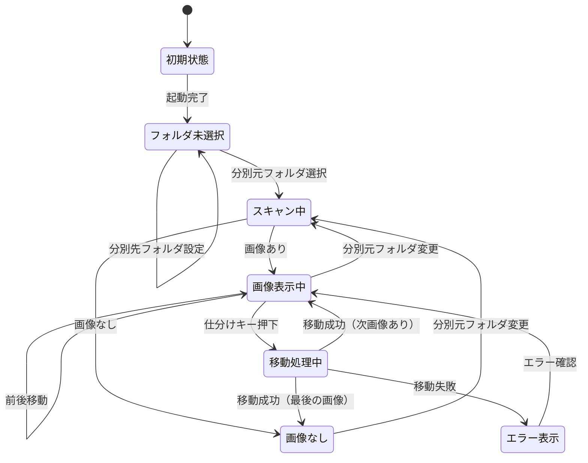
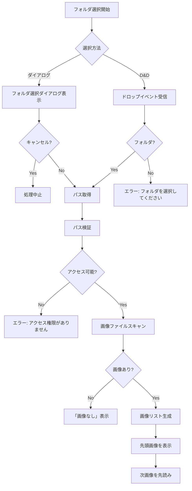
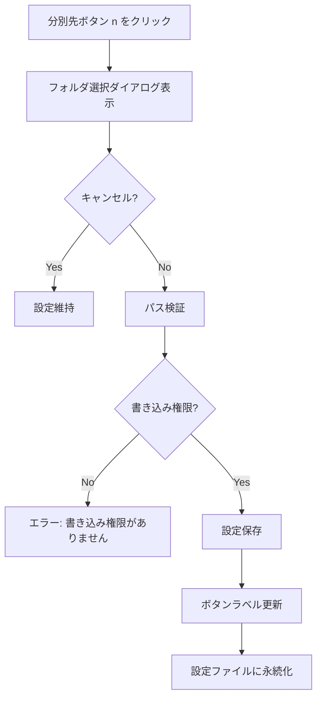
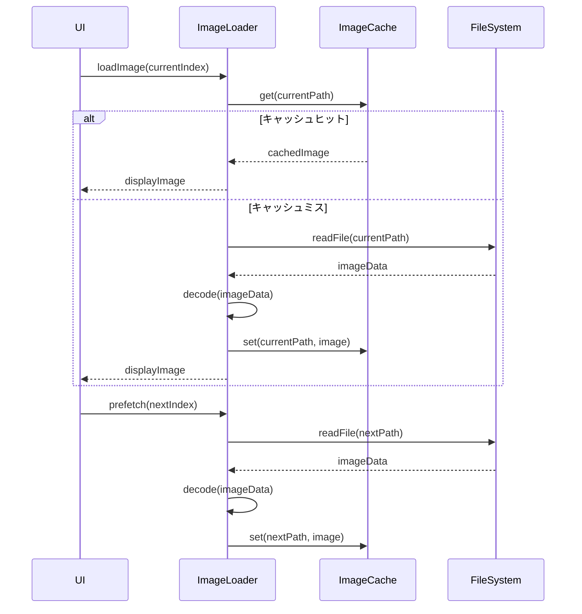
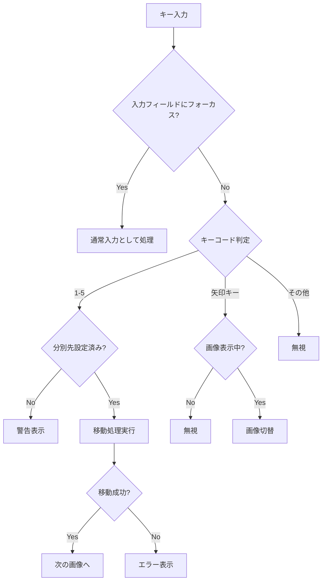
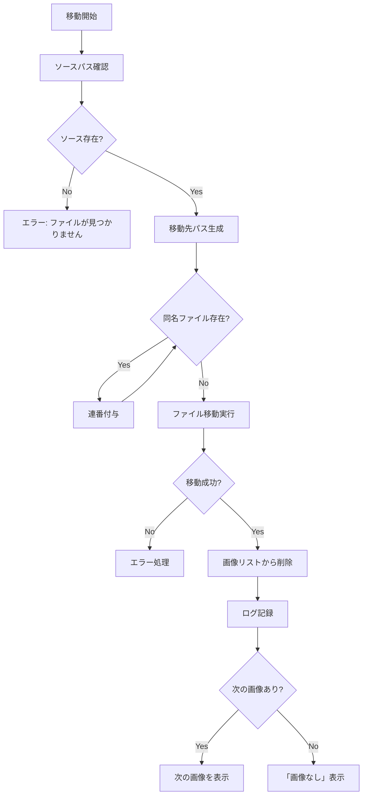
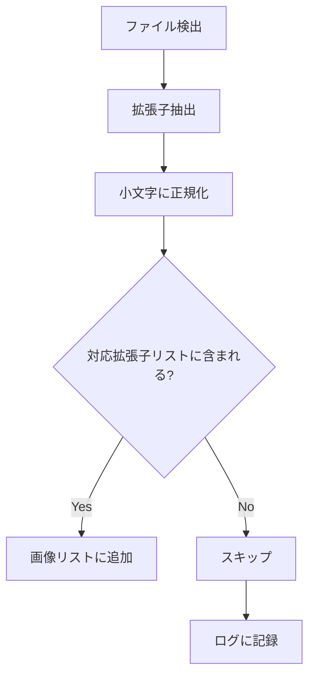
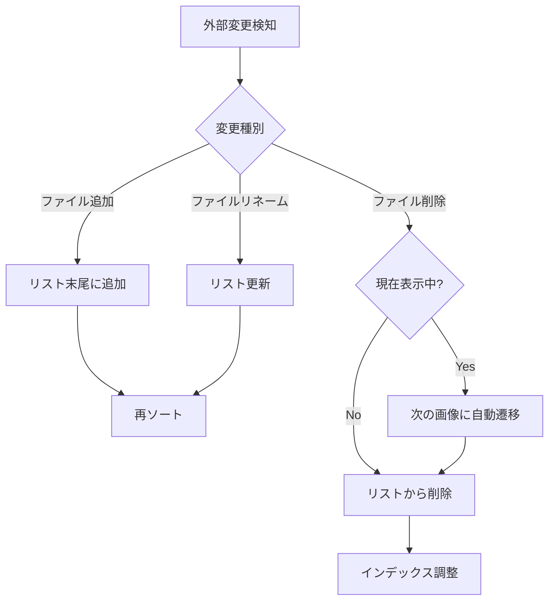
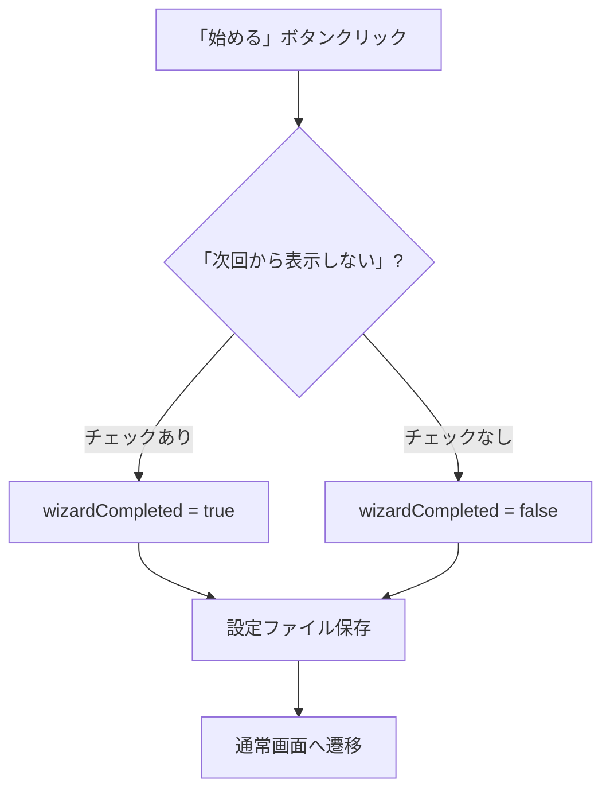

# 機能要件詳細

このドキュメントでは、画像仕分けアプリの各機能について詳細な仕様を定義する。

## 1. アプリケーション状態遷移



## 2. 分別元フォルダ選択

### 2.1 概要
仕分け対象の画像が格納されたフォルダを指定する機能。

### 2.2 選択方法

| 方法 | 操作 | 詳細 |
|------|------|------|
| ダイアログ | ボタンクリック | OSネイティブのフォルダ選択ダイアログを表示 |
| ドラッグ&ドロップ | フォルダをウィンドウにD&D | アプリウィンドウ全体がドロップターゲット |

### 2.3 処理フロー



### 2.4 画像スキャン仕様

| 項目 | 仕様 |
|------|------|
| 対象拡張子 | .jpg, .jpeg, .png, .gif, .bmp, .webp（大文字小文字不問） |
| サブフォルダ | スキャン対象外（直下のみ） |
| 並び順 | ファイル名昇順（自然順ソート） |
| 隠しファイル | 除外（.で始まるファイル） |
| シンボリックリンク | 警告ログを出力してスキップ |
| ネットワークドライブ | 対応（初回選択時に速度警告を表示） |

### 2.5 エッジケース

| ケース | 動作 |
|--------|------|
| 空フォルダ | 「画像なし」表示 |
| 対応外ファイルのみ | 「画像なし」表示、ログに記録 |
| アクセス権限なし | エラーメッセージ表示 |
| パスが存在しない | エラーメッセージ表示 |
| スキャン中にフォルダ削除 | エラーメッセージ表示、フォルダ未選択状態へ |

## 3. 分別先フォルダ設定

### 3.1 概要
数字キー（1〜5）に対応する移動先フォルダを設定する機能。

### 3.2 設定方法



### 3.3 設定状態

| 状態 | ボタン表示 | キー押下時の動作 |
|------|-----------|-----------------|
| 未設定 | `1: 未設定` | 警告「分別先フォルダを設定してください」 |
| 設定済み | `1: フォルダ名` | 画像を移動 |

### 3.4 設定の永続化

設定は以下のタイミングで保存:
- フォルダ設定変更時
- アプリ終了時

設定ファイル形式:
```json
{
  "destinations": {
    "1": "/path/to/folder1",
    "2": "/path/to/folder2",
    "3": null,
    "4": null,
    "5": null
  }
}
```

### 3.5 設定解除

- 同じフォルダを再選択: 設定解除確認ダイアログ
- 右クリック/長押し: コンテキストメニューから「解除」

## 4. 画像表示

### 4.1 表示仕様

| 項目 | 仕様 |
|------|------|
| 表示形式 | スライドショー（1枚ずつ） |
| フィット方式 | アスペクト比維持、プレビュー領域にフィット |
| 背景色 | ダークテーマ: #1e1e1e / ライトテーマ: #f0f0f0 |
| アニメーション | フェード（150ms） |

### 4.2 画像読み込みフロー



### 4.3 先読み戦略

| 項目 | 仕様 |
|------|------|
| 先読み枚数 | 1枚（次の画像のみ） |
| タイミング | 現在画像の表示完了後 |
| キャッシュ保持 | 現在画像 + 先読み画像 |
| キャッシュ解放 | 表示完了した前の画像 |

### 4.4 エラーハンドリング

| エラー | 動作 |
|--------|------|
| デコード失敗 | スキップしてログに記録、次の画像へ |
| ファイル読み込み失敗 | スキップしてログに記録、次の画像へ |
| メモリ不足 | キャッシュクリア、再試行 |

## 5. キーボード操作

### 5.1 キーバインド一覧

| キー | 動作 | 条件 |
|------|------|------|
| `1` | 分別先1へ移動 | 分別先1が設定済み |
| `2` | 分別先2へ移動 | 分別先2が設定済み |
| `3` | 分別先3へ移動 | 分別先3が設定済み |
| `4` | 分別先4へ移動 | 分別先4が設定済み |
| `5` | 分別先5へ移動 | 分別先5が設定済み |
| `←` / `A` | 前の画像 | 画像表示中 |
| `→` / `D` | 次の画像 | 画像表示中 |
| `Space` | 次の画像 | 画像表示中 |
| `Backspace` | 前の画像 | 画像表示中 |
| `Escape` | フルスクリーン解除 | フルスクリーン中 |
| `F` | フルスクリーン切替 | 常時 |

### 5.2 キー入力処理



### 5.3 キーリピート制御

| 項目 | 仕様 |
|------|------|
| 仕分けキー（1-5） | リピート無効（押下1回で1回のみ処理） |
| 移動キー（矢印等） | リピート有効 |
| リピート間隔 | OS設定に従う |

## 6. ファイル移動

### 6.1 移動処理フロー



### 6.2 同名ファイル処理

重複時の連番付与ルール:

| 元ファイル名 | 重複時 |
|-------------|--------|
| `photo.jpg` | `photo_1.jpg`, `photo_2.jpg`, ... |
| `image_1.png` | `image_1_1.png`, `image_1_2.png`, ... |

連番検索上限: 999（超過時はエラー）

### 6.3 アトミック操作

| 項目 | 仕様 |
|------|------|
| 方式 | Rustの `std::fs::rename` 使用 |
| 同一ファイルシステム | 即座に完了 |
| 異なるファイルシステム | コピー後に削除 |
| 失敗時 | 元ファイル保持、ロールバック不要 |

### 6.4 エラー時の動作

| エラー種別 | 動作 | ユーザー通知 |
|-----------|------|-------------|
| 権限不足 | 処理中止 | 「書き込み権限がありません」 |
| ディスクフル | 処理中止 | 「ディスク容量が不足しています」 |
| ファイル使用中 | 処理中止 | 「ファイルが使用中です」 |
| ネットワークエラー | 処理中止 | 「ネットワークエラーが発生しました」 |

## 7. 画像リスト管理

### 7.1 リスト構造

```typescript
interface ImageList {
  sourcePath: string;        // 分別元フォルダパス
  images: ImageInfo[];       // 画像情報配列
  currentIndex: number;      // 現在表示中のインデックス
}

interface ImageInfo {
  path: string;              // 絶対パス
  name: string;              // ファイル名
  size: number;              // ファイルサイズ（バイト）
  modifiedAt: Date;          // 更新日時
}
```

### 7.2 リスト操作

| 操作 | トリガー | 処理 |
|------|----------|------|
| 生成 | フォルダ選択 | スキャンして画像リスト作成 |
| 削除 | 移動成功 | リストから該当画像を削除 |
| 再生成 | フォルダ変更 | 既存リストをクリアして再スキャン |
| インデックス更新 | 画像切替 | currentIndex を変更 |

### 7.3 インデックス境界処理

| 状況 | 動作 |
|------|------|
| 先頭で「前へ」 | 何もしない（循環しない） |
| 末尾で「次へ」 | 何もしない（循環しない） |
| 移動後インデックス超過 | 新しい末尾に調整 |

## 8. 対応拡張子フィルタ

### 8.1 判定フロー



### 8.2 対応拡張子詳細

| 拡張子 | MIMEタイプ | 備考 |
|--------|-----------|------|
| `.jpg`, `.jpeg` | image/jpeg | 最も一般的 |
| `.png` | image/png | 透過サポート |
| `.gif` | image/gif | 静止画として表示 |
| `.bmp` | image/bmp | 非圧縮 |
| `.webp` | image/webp | 静止画として表示 |

### 8.3 将来の拡張候補

| 拡張子 | 優先度 | 備考 |
|--------|--------|------|
| `.heic`, `.heif` | 中 | iOS写真形式 |
| `.avif` | 低 | 次世代フォーマット |
| `.svg` | 低 | ベクター画像 |
| `.raw`, `.dng` | 低 | RAW画像 |

## 9. 外部変更検知

### 9.1 概要
分別元フォルダの内容が外部アプリケーションから変更された場合、自動的にリストを更新する。

### 9.2 監視仕様

| 項目 | 仕様 |
|------|------|
| 監視方式 | OSネイティブ（FSEvents/inotify） |
| 検知対象 | ファイル作成、削除、リネーム |
| 更新タイミング | 変更検知後500msのデバウンス |
| 監視対象 | 分別元フォルダ直下のみ（サブフォルダは対象外） |

### 9.3 状態遷移



### 9.4 ネットワークドライブの場合

| 状況 | 対応 |
|------|------|
| ファイルシステム監視が利用可能 | 通常どおり監視 |
| ファイルシステム監視が利用不可 | ポーリング（30秒間隔）にフォールバック |
| ポーリング中の変更検知 | 差分比較で追加/削除を検出 |

## 10. 初回起動ウィザード

### 10.1 表示条件

- アプリ初回起動時
- 設定ファイルが存在しない場合
- `wizardCompleted` フラグが `false` の場合

### 10.2 ウィザード内容（1ステップ）

キー操作の簡潔な説明を表示するモーダル：

| 要素 | 内容 |
|------|------|
| タイトル | 「ようこそ picSort へ」 |
| 説明1 | 「1〜5キーで画像を各フォルダに仕分けます」 |
| 説明2 | 「←→キーで画像を切り替えます」 |
| 説明3 | 「まず分別先フォルダを設定しましょう」 |
| ボタン | 「始める」 |
| チェックボックス | 「次回から表示しない」 |

### 10.3 ウィザード終了後



### 10.4 設定ファイル構造（追加項目）

```json
{
  "destinations": { ... },
  "theme": "system",
  "language": "ja",
  "animation": true,
  "keyRepeat": true,
  "wizardCompleted": false,
  "window": { ... }
}
```
