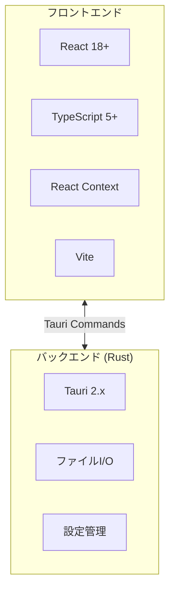

# 画像仕分けアプリ 仕様書

最終更新: 2025-12-20
作成目的: フォルダ内の画像をキーボード操作で素早く仕分けるデスクトップアプリの実装指針を示す。

> 詳細な機能仕様は [functional-requirements.md](./functional-requirements.md) を、UI設計は [ui-ux-design.md](./ui-ux-design.md) を参照してください。

## 1. 対象プラットフォームと技術スタック

### 1.1 対象OS
| OS | バージョン |
|----|-----------|
| Windows | 10 以降 |
| macOS | 12 (Monterey) 以降 |

### 1.2 技術スタック

| レイヤー | 技術 | バージョン | 用途 |
|---------|------|-----------|------|
| デスクトップフレームワーク | Tauri | 2.x | ネイティブ機能・ウィンドウ管理 |
| フロントエンド | React | 18+ | UI構築 |
| 言語 | TypeScript | 5+ | 型安全なフロントエンド開発 |
| ビルドツール | Vite | 5+ | 高速な開発サーバー・バンドル |
| 状態管理 | React Context | - | アプリケーション状態管理 |
| バックエンド | Rust | 1.70+ | ファイルI/O・ネイティブ処理 |

### 1.3 設計方針
- OS依存I/O（パス表記、ファイル移動）はRust側コマンドで吸収
- フロントからはTauriコマンド経由で呼び出し
- 画像デコードはフロント（Canvas/HTMLImageElement）側で実行
- 必要に応じてRustでメタ情報（Exif等）を取得

## 2. 用語定義

| 用語 | 定義 |
|------|------|
| 分別元フォルダ | 仕分け対象の画像が入ったフォルダ |
| 分別先フォルダ | 数字キー（1〜5）に割り当てる移動先フォルダ |
| 現在画像 | プレビュー領域に表示中の画像 |
| 先読み | 次に表示する画像を事前にロードする機能 |
| 仕分け操作 | 数字キー押下による画像の移動処理 |

## 3. 機能概要

コア機能の概要を以下に示す。詳細は [functional-requirements.md](./functional-requirements.md) を参照。

| 機能 | 概要 |
|------|------|
| 分別元フォルダ選択 | ダイアログ/D&Dでフォルダを指定 |
| 分別先フォルダ設定 | 1〜5キーに移動先フォルダを割当 |
| 画像表示 | スライドショー形式で1枚ずつ表示 |
| キーボード操作 | 数字キーで仕分け、矢印キーで移動 |
| ファイル移動 | 選択フォルダへ画像を移動（コピーではない） |

## 4. 非機能要件

### 4.1 パフォーマンス
| 項目 | 目標値 |
|------|--------|
| 操作応答時間 | 100ms 未満 |
| 対応画像枚数 | 1,000枚以上のフォルダでも遅延なし |
| 画像切替時間 | 先読みにより即座に表示 |
| メモリ使用量 | 先読み画像は1枚のみ保持 |

### 4.2 設定保持
- 保存場所: Tauriの `app_dir` 配下
- 保存形式: JSON
- 保存内容:
  - 分別先フォルダパス（1〜5）
  - テーマ設定（ダーク/ライト）
  - ウィンドウサイズ・位置

### 4.3 ログ出力
- 出力先: アプリデータディレクトリ
- 形式: テキストファイル（日付ローテーション）
- 記録内容:
  - ファイル移動結果
  - スキップ理由
  - エラー詳細

### 4.4 国際化（i18n）
- 対応言語: 日本語 / 英語
- 実装方式: リソースファイル（JSON）による切替
- 切替方法: 設定画面から変更

## 5. 対応ファイル形式

| 拡張子 | MIME Type | 備考 |
|--------|-----------|------|
| .jpg, .jpeg | image/jpeg | 標準対応 |
| .png | image/png | 透過対応 |
| .gif | image/gif | 静止画のみ（アニメーション非対応） |
| .bmp | image/bmp | 非圧縮ビットマップ |
| .webp | image/webp | 静止画のみ |

対応外の拡張子はスキップし、ログに記録。

## 6. バンドル・配布設定

### 6.1 Windows
| 形式 | 説明 |
|------|------|
| .msi | インストーラー（推奨） |
| .exe | ポータブル実行ファイル |

### 6.2 macOS
| 形式 | 説明 |
|------|------|
| .dmg | ディスクイメージ（推奨） |
| .app | アプリケーションバンドル |

### 6.3 Tauri設定
`tauri.conf.json` で以下を定義:
- アプリ名・バージョン
- アイコン
- ウィンドウ初期サイズ
- 許可するTauriコマンド
- バンドル設定（署名、識別子）

## 7. 自動更新

- 初期リリース時点では自動更新機能は不要
- 将来的にはTauri updaterを検討
- 更新確認: 起動時にリモートチェック
- 更新適用: ユーザー確認後に実行

## 8. 関連ドキュメント

- [機能要件詳細](./functional-requirements.md)
- [UI/UX設計](./ui-ux-design.md)
- [技術アーキテクチャ](./architecture.md)
- [エラー処理](./error-handling.md)
- [テスト戦略](./testing.md)
- [拡張機能仕様](./extensions.md)
