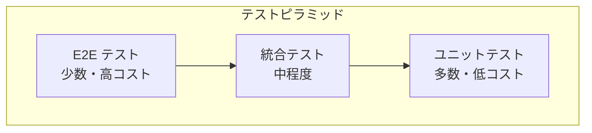

# テスト戦略・テストケース

このドキュメントでは、画像仕分けアプリのテスト方針、テストケース、CI/CD設定を定義する。

## 1. テスト戦略

### 1.1 テストピラミッド



### 1.2 テスト種別と責務

| 種別 | 対象 | ツール | カバレッジ目標 |
|------|------|--------|--------------|
| Rustユニットテスト | Rustコード | cargo test | 80% |
| Reactコンポーネントテスト | UIコンポーネント | Vitest + Testing Library | 70% |
| 統合テスト | Tauri IPC | Vitest | 60% |
| E2Eテスト | アプリ全体 | Playwright + Tauri Driver | 主要フロー100% |

## 2. Rustユニットテスト

### 2.1 テスト対象

| モジュール | テスト内容 |
|-----------|-----------|
| `file_ops` | ファイル移動、連番生成、拡張子フィルタ |
| `config` | 設定読み込み/保存、デフォルト値 |
| `utils/path` | パス正規化、検証 |

### 2.2 テストケース：ファイル移動

```rust
// src-tauri/src/commands/file_ops.rs

#[cfg(test)]
mod tests {
    use super::*;
    use std::fs::{self, File};
    use tempfile::tempdir;

    #[test]
    fn test_move_file_success() {
        let src_dir = tempdir().unwrap();
        let dest_dir = tempdir().unwrap();

        let src_path = src_dir.path().join("test.jpg");
        File::create(&src_path).unwrap();

        let result = move_file(
            src_path.to_string_lossy().to_string(),
            dest_dir.path().to_string_lossy().to_string(),
        );

        assert!(result.is_ok());
        assert!(!src_path.exists());
        assert!(dest_dir.path().join("test.jpg").exists());
    }

    #[test]
    fn test_move_file_with_duplicate() {
        let src_dir = tempdir().unwrap();
        let dest_dir = tempdir().unwrap();

        // 元ファイル作成
        let src_path = src_dir.path().join("test.jpg");
        File::create(&src_path).unwrap();

        // 移動先に同名ファイルを作成
        File::create(dest_dir.path().join("test.jpg")).unwrap();

        let result = move_file(
            src_path.to_string_lossy().to_string(),
            dest_dir.path().to_string_lossy().to_string(),
        );

        assert!(result.is_ok());
        assert!(dest_dir.path().join("test_1.jpg").exists());
    }

    #[test]
    fn test_move_file_source_not_found() {
        let dest_dir = tempdir().unwrap();

        let result = move_file(
            "/nonexistent/path/file.jpg".to_string(),
            dest_dir.path().to_string_lossy().to_string(),
        );

        assert!(result.is_err());
        assert!(result.unwrap_err().contains("not found"));
    }

    #[test]
    fn test_generate_unique_path_no_conflict() {
        let dir = tempdir().unwrap();
        let result = generate_unique_path(
            dir.path().to_string_lossy().as_ref(),
            "photo.jpg",
        );

        assert!(result.is_ok());
        assert!(result.unwrap().ends_with("photo.jpg"));
    }

    #[test]
    fn test_generate_unique_path_with_conflicts() {
        let dir = tempdir().unwrap();

        // 衝突ファイル作成
        File::create(dir.path().join("photo.jpg")).unwrap();
        File::create(dir.path().join("photo_1.jpg")).unwrap();
        File::create(dir.path().join("photo_2.jpg")).unwrap();

        let result = generate_unique_path(
            dir.path().to_string_lossy().as_ref(),
            "photo.jpg",
        );

        assert!(result.is_ok());
        assert!(result.unwrap().ends_with("photo_3.jpg"));
    }
}
```

### 2.3 テストケース：画像スキャン

```rust
#[cfg(test)]
mod scan_tests {
    use super::*;
    use std::fs::File;
    use tempfile::tempdir;

    #[test]
    fn test_scan_images_finds_supported_formats() {
        let dir = tempdir().unwrap();

        // サポート形式のファイル作成
        File::create(dir.path().join("image1.jpg")).unwrap();
        File::create(dir.path().join("image2.PNG")).unwrap();
        File::create(dir.path().join("image3.gif")).unwrap();

        let result = scan_images(dir.path().to_string_lossy().to_string());

        assert!(result.is_ok());
        assert_eq!(result.unwrap().len(), 3);
    }

    #[test]
    fn test_scan_images_filters_unsupported() {
        let dir = tempdir().unwrap();

        File::create(dir.path().join("image.jpg")).unwrap();
        File::create(dir.path().join("document.pdf")).unwrap();
        File::create(dir.path().join("data.txt")).unwrap();

        let result = scan_images(dir.path().to_string_lossy().to_string());

        assert!(result.is_ok());
        assert_eq!(result.unwrap().len(), 1);
    }

    #[test]
    fn test_scan_images_empty_folder() {
        let dir = tempdir().unwrap();

        let result = scan_images(dir.path().to_string_lossy().to_string());

        assert!(result.is_ok());
        assert!(result.unwrap().is_empty());
    }

    #[test]
    fn test_scan_images_sorted_naturally() {
        let dir = tempdir().unwrap();

        File::create(dir.path().join("img2.jpg")).unwrap();
        File::create(dir.path().join("img10.jpg")).unwrap();
        File::create(dir.path().join("img1.jpg")).unwrap();

        let result = scan_images(dir.path().to_string_lossy().to_string()).unwrap();

        assert_eq!(result[0].name, "img1.jpg");
        assert_eq!(result[1].name, "img2.jpg");
        assert_eq!(result[2].name, "img10.jpg");
    }

    #[test]
    fn test_scan_images_excludes_hidden() {
        let dir = tempdir().unwrap();

        File::create(dir.path().join("visible.jpg")).unwrap();
        File::create(dir.path().join(".hidden.jpg")).unwrap();

        let result = scan_images(dir.path().to_string_lossy().to_string());

        assert!(result.is_ok());
        assert_eq!(result.unwrap().len(), 1);
    }
}
```

### 2.4 テストケース：設定管理

```rust
#[cfg(test)]
mod config_tests {
    use super::*;
    use tempfile::tempdir;

    #[test]
    fn test_load_settings_default() {
        let dir = tempdir().unwrap();
        let config_path = dir.path().join("settings.json");

        let result = load_settings(config_path.to_string_lossy().to_string());

        assert!(result.is_ok());
        let settings = result.unwrap();
        assert_eq!(settings.destinations.len(), 5);
        assert!(settings.destinations.values().all(|v| v.is_none()));
    }

    #[test]
    fn test_save_and_load_settings() {
        let dir = tempdir().unwrap();
        let config_path = dir.path().join("settings.json");

        let mut settings = Settings::default();
        settings.destinations.insert("1".to_string(), Some("/path/to/folder1".to_string()));
        settings.theme = Theme::Dark;

        save_settings(&settings, config_path.to_string_lossy().to_string()).unwrap();
        let loaded = load_settings(config_path.to_string_lossy().to_string()).unwrap();

        assert_eq!(loaded.destinations.get("1"), settings.destinations.get("1"));
        assert!(matches!(loaded.theme, Theme::Dark));
    }
}
```

## 3. Reactコンポーネントテスト

### 3.1 テスト設定

```typescript
// vitest.config.ts
import { defineConfig } from 'vitest/config';
import react from '@vitejs/plugin-react';

export default defineConfig({
  plugins: [react()],
  test: {
    environment: 'jsdom',
    setupFiles: ['./src/test/setup.ts'],
    globals: true,
    coverage: {
      provider: 'v8',
      reporter: ['text', 'html'],
      include: ['src/**/*.{ts,tsx}'],
      exclude: ['src/**/*.test.{ts,tsx}', 'src/test/**'],
    },
  },
});
```

```typescript
// src/test/setup.ts
import '@testing-library/jest-dom';
import { vi } from 'vitest';

// Tauri APIのモック
vi.mock('@tauri-apps/api/core', () => ({
  invoke: vi.fn(),
}));

vi.mock('@tauri-apps/plugin-dialog', () => ({
  open: vi.fn(),
}));
```

### 3.2 テストケース：DestButton

```typescript
// src/components/DestinationButtons/DestButton.test.tsx
import { render, screen, fireEvent } from '@testing-library/react';
import { describe, it, expect, vi } from 'vitest';
import { DestButton } from './DestButton';

describe('DestButton', () => {
  it('未設定時に「未設定」と表示される', () => {
    render(
      <DestButton
        number={1}
        folderName={null}
        isConfigured={false}
        onClick={() => {}}
      />
    );

    expect(screen.getByText('1: 未設定')).toBeInTheDocument();
  });

  it('設定済み時にフォルダ名が表示される', () => {
    render(
      <DestButton
        number={2}
        folderName="風景"
        isConfigured={true}
        onClick={() => {}}
      />
    );

    expect(screen.getByText('2: 風景')).toBeInTheDocument();
  });

  it('クリック時にonClickが呼ばれる', () => {
    const handleClick = vi.fn();
    render(
      <DestButton
        number={1}
        folderName={null}
        isConfigured={false}
        onClick={handleClick}
      />
    );

    fireEvent.click(screen.getByRole('button'));
    expect(handleClick).toHaveBeenCalledTimes(1);
  });

  it('長いフォルダ名が省略される', () => {
    render(
      <DestButton
        number={1}
        folderName="とても長いフォルダ名です"
        isConfigured={true}
        onClick={() => {}}
      />
    );

    expect(screen.getByText('1: とても長いフォ...')).toBeInTheDocument();
  });

  it('ツールチップにフルパスが表示される', () => {
    render(
      <DestButton
        number={1}
        folderName="風景"
        fullPath="/Users/example/Pictures/風景"
        isConfigured={true}
        onClick={() => {}}
      />
    );

    const button = screen.getByRole('button');
    expect(button).toHaveAttribute('title', '/Users/example/Pictures/風景');
  });
});
```

### 3.3 テストケース：ImageViewer

```typescript
// src/components/PreviewArea/ImageViewer.test.tsx
import { render, screen, waitFor } from '@testing-library/react';
import { describe, it, expect, vi } from 'vitest';
import { ImageViewer } from './ImageViewer';

describe('ImageViewer', () => {
  it('画像が正常に表示される', async () => {
    render(<ImageViewer src="/test-image.jpg" alt="Test Image" />);

    const img = screen.getByRole('img');
    expect(img).toHaveAttribute('src', '/test-image.jpg');
    expect(img).toHaveAttribute('alt', 'Test Image');
  });

  it('ローディング中はスピナーが表示される', () => {
    render(<ImageViewer src="/test-image.jpg" alt="Test" isLoading={true} />);

    expect(screen.getByTestId('loading-spinner')).toBeInTheDocument();
  });

  it('エラー時にエラーメッセージが表示される', async () => {
    const onError = vi.fn();
    render(
      <ImageViewer
        src="/invalid-image.jpg"
        alt="Test"
        onError={onError}
      />
    );

    const img = screen.getByRole('img');
    fireEvent.error(img);

    await waitFor(() => {
      expect(onError).toHaveBeenCalled();
    });
  });
});
```

### 3.4 テストケース：useKeyboard

```typescript
// src/hooks/useKeyboard.test.tsx
import { renderHook } from '@testing-library/react';
import { describe, it, expect, vi, beforeEach } from 'vitest';
import { useKeyboard } from './useKeyboard';
import { AppProvider } from '../contexts/AppContext';

describe('useKeyboard', () => {
  const wrapper = ({ children }: { children: React.ReactNode }) => (
    <AppProvider>{children}</AppProvider>
  );

  beforeEach(() => {
    vi.clearAllMocks();
  });

  it('数字キーで分別先が呼び出される', () => {
    const mockMoveFile = vi.fn();
    renderHook(() => useKeyboard({ onMove: mockMoveFile }), { wrapper });

    fireEvent.keyDown(document, { key: '1' });

    expect(mockMoveFile).toHaveBeenCalledWith('1');
  });

  it('矢印キーで画像が切り替わる', () => {
    const mockNavigate = vi.fn();
    renderHook(() => useKeyboard({ onNavigate: mockNavigate }), { wrapper });

    fireEvent.keyDown(document, { key: 'ArrowRight' });
    expect(mockNavigate).toHaveBeenCalledWith('next');

    fireEvent.keyDown(document, { key: 'ArrowLeft' });
    expect(mockNavigate).toHaveBeenCalledWith('prev');
  });

  it('入力フィールドフォーカス時はショートカットが無効', () => {
    const mockMoveFile = vi.fn();
    renderHook(() => useKeyboard({ onMove: mockMoveFile }), { wrapper });

    const input = document.createElement('input');
    document.body.appendChild(input);
    input.focus();

    fireEvent.keyDown(input, { key: '1' });

    expect(mockMoveFile).not.toHaveBeenCalled();
    document.body.removeChild(input);
  });
});
```

## 4. E2Eテスト

### 4.1 Playwright設定

```typescript
// playwright.config.ts
import { defineConfig, devices } from '@playwright/test';

export default defineConfig({
  testDir: './tests/e2e',
  fullyParallel: true,
  forbidOnly: !!process.env.CI,
  retries: process.env.CI ? 2 : 0,
  workers: process.env.CI ? 1 : undefined,
  reporter: 'html',
  use: {
    trace: 'on-first-retry',
  },
  projects: [
    {
      name: 'tauri',
      use: { ...devices['Desktop Chrome'] },
    },
  ],
});
```

### 4.2 Tauri Driver設定

```typescript
// tests/e2e/helpers/tauri-driver.ts
import { spawn, ChildProcess } from 'child_process';

let tauriDriver: ChildProcess | null = null;

export async function startTauriDriver(): Promise<string> {
  return new Promise((resolve, reject) => {
    tauriDriver = spawn('npx', ['tauri-driver'], {
      stdio: ['ignore', 'pipe', 'inherit'],
    });

    tauriDriver.stdout?.on('data', (data) => {
      const output = data.toString();
      const match = output.match(/listening on (http:\/\/[\w.:]+)/);
      if (match) {
        resolve(match[1]);
      }
    });

    tauriDriver.on('error', reject);
  });
}

export function stopTauriDriver() {
  if (tauriDriver) {
    tauriDriver.kill();
    tauriDriver = null;
  }
}
```

### 4.3 E2Eテストケース

```typescript
// tests/e2e/image-sorting.spec.ts
import { test, expect } from '@playwright/test';
import path from 'path';

test.describe('画像仕分けフロー', () => {
  test.beforeEach(async ({ page }) => {
    // Tauriアプリを起動
    await page.goto('tauri://localhost');
  });

  test('フォルダ選択から画像表示まで', async ({ page }) => {
    // フォルダ選択ボタンをクリック
    await page.click('[data-testid="folder-select-button"]');

    // ダイアログでフォルダを選択（モック）
    // 実際のE2Eではファイルシステムの準備が必要

    // 画像が表示されることを確認
    await expect(page.locator('[data-testid="image-viewer"]')).toBeVisible();

    // ステータスバーに情報が表示される
    await expect(page.locator('[data-testid="image-counter"]')).toContainText('/');
  });

  test('キーボードで仕分け操作', async ({ page }) => {
    // 準備：フォルダと画像をセットアップ

    // 分別先1を設定
    await page.click('[data-testid="dest-button-1"]');
    // ダイアログでフォルダ選択

    // 1キーを押して仕分け
    await page.keyboard.press('1');

    // 成功メッセージを確認
    await expect(page.locator('[data-testid="status-message"]')).toContainText('移動完了');

    // 次の画像が表示されることを確認
    await expect(page.locator('[data-testid="image-counter"]')).not.toContainText('1/');
  });

  test('画像なし状態の表示', async ({ page }) => {
    // 空フォルダを選択
    // ...

    // 「画像なし」表示を確認
    await expect(page.locator('[data-testid="empty-state"]')).toBeVisible();
    await expect(page.locator('[data-testid="empty-state"]')).toContainText('画像がありません');
  });

  test('分別先未設定での仕分け試行', async ({ page }) => {
    // 画像を表示状態にする
    // ...

    // 未設定の分別先キーを押す
    await page.keyboard.press('3');

    // 警告メッセージを確認
    await expect(page.locator('[data-testid="status-message"]')).toContainText('分別先を設定してください');
  });
});
```

## 5. テストカバレッジ目標

| モジュール | 目標 | 測定方法 |
|-----------|------|---------|
| Rust commands | 80% | `cargo tarpaulin` |
| React components | 70% | Vitest coverage |
| Custom hooks | 80% | Vitest coverage |
| E2E (主要フロー) | 100% | Playwright |

### 5.1 カバレッジレポート出力

```bash
# Rust
cargo tarpaulin --out Html --output-dir coverage/rust

# React
npm run test -- --coverage

# 結合レポート
npm run coverage:merge
```

## 6. CI/CD設定

### 6.1 GitHub Actions

```yaml
# .github/workflows/test.yml
name: Test

on:
  push:
    branches: [main]
  pull_request:
    branches: [main]

jobs:
  rust-test:
    runs-on: ubuntu-latest
    steps:
      - uses: actions/checkout@v4

      - name: Install Rust
        uses: dtolnay/rust-action@stable

      - name: Install dependencies
        run: |
          sudo apt-get update
          sudo apt-get install -y libwebkit2gtk-4.1-dev libappindicator3-dev librsvg2-dev

      - name: Run Rust tests
        run: cargo test --manifest-path src-tauri/Cargo.toml

      - name: Run Rust coverage
        uses: actions-rs/tarpaulin@v0.1
        with:
          args: '--manifest-path src-tauri/Cargo.toml --out Xml'

      - name: Upload coverage
        uses: codecov/codecov-action@v3
        with:
          files: cobertura.xml
          flags: rust

  frontend-test:
    runs-on: ubuntu-latest
    steps:
      - uses: actions/checkout@v4

      - name: Setup Node.js
        uses: actions/setup-node@v4
        with:
          node-version: '20'
          cache: 'npm'

      - name: Install dependencies
        run: npm ci

      - name: Run tests
        run: npm test -- --coverage

      - name: Upload coverage
        uses: codecov/codecov-action@v3
        with:
          files: coverage/lcov.info
          flags: frontend

  e2e-test:
    runs-on: ubuntu-latest
    needs: [rust-test, frontend-test]
    steps:
      - uses: actions/checkout@v4

      - name: Install dependencies
        run: |
          sudo apt-get update
          sudo apt-get install -y libwebkit2gtk-4.1-dev libappindicator3-dev librsvg2-dev

      - name: Setup Node.js
        uses: actions/setup-node@v4
        with:
          node-version: '20'
          cache: 'npm'

      - name: Install dependencies
        run: npm ci

      - name: Install Playwright
        run: npx playwright install --with-deps

      - name: Build Tauri app
        run: npm run tauri build -- --debug

      - name: Run E2E tests
        run: npm run test:e2e

      - name: Upload Playwright report
        uses: actions/upload-artifact@v4
        if: always()
        with:
          name: playwright-report
          path: playwright-report/
```

### 6.2 テストスクリプト

```json
// package.json
{
  "scripts": {
    "test": "vitest",
    "test:watch": "vitest watch",
    "test:coverage": "vitest --coverage",
    "test:e2e": "playwright test",
    "test:e2e:ui": "playwright test --ui",
    "test:all": "npm run test && npm run test:e2e"
  }
}
```

## 7. テストデータ

### 7.1 テスト用画像ファイル

| ファイル | サイズ | 用途 |
|---------|--------|------|
| `test_small.jpg` | 100x100px | 基本テスト |
| `test_large.jpg` | 4000x3000px | 大サイズテスト |
| `test_wide.png` | 1920x400px | アスペクト比テスト |
| `test_tall.png` | 400x1920px | アスペクト比テスト |
| `test_corrupted.jpg` | - | エラーハンドリングテスト |
| `test_unsupported.tiff` | - | 未対応形式テスト |

### 7.2 テストフィクスチャ

```typescript
// tests/fixtures/index.ts
import path from 'path';

export const TEST_IMAGES_DIR = path.join(__dirname, 'images');
export const TEST_DEST_DIR = path.join(__dirname, 'destinations');

export const testImages = {
  small: path.join(TEST_IMAGES_DIR, 'test_small.jpg'),
  large: path.join(TEST_IMAGES_DIR, 'test_large.jpg'),
  wide: path.join(TEST_IMAGES_DIR, 'test_wide.png'),
  tall: path.join(TEST_IMAGES_DIR, 'test_tall.png'),
  corrupted: path.join(TEST_IMAGES_DIR, 'test_corrupted.jpg'),
};

export const testSettings = {
  default: {
    destinations: { '1': null, '2': null, '3': null, '4': null, '5': null },
    theme: 'system',
    language: 'ja',
  },
  configured: {
    destinations: {
      '1': '/path/to/folder1',
      '2': '/path/to/folder2',
      '3': null,
      '4': null,
      '5': null,
    },
    theme: 'dark',
    language: 'ja',
  },
};
```
