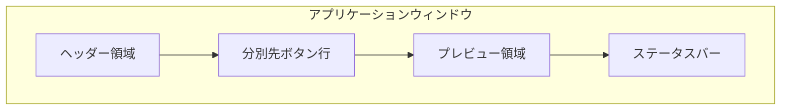
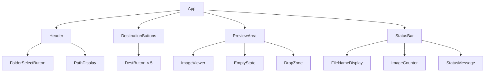
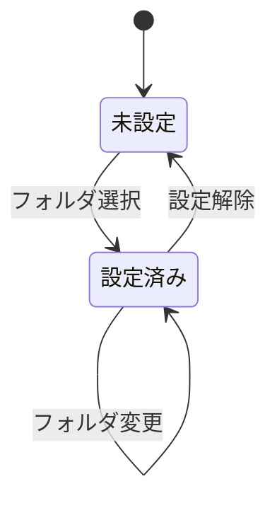
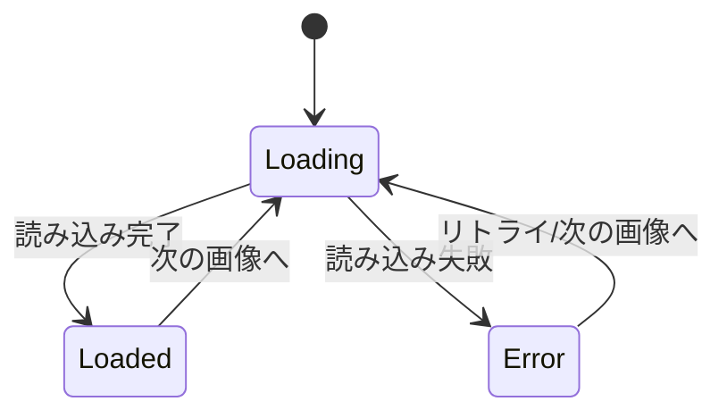
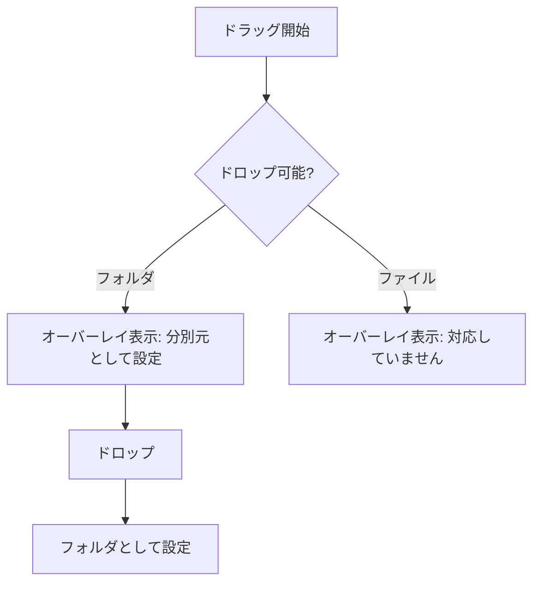

# UI/UX 詳細設計

このドキュメントでは、画像仕分けアプリのユーザーインターフェースとユーザーエクスペリエンスの詳細を定義する。

## 1. 画面構成

### 1.1 全体レイアウト



### 1.2 レイアウト詳細

```
┌─────────────────────────────────────────────────────────────────┐
│  [フォルダを選択] | /Users/example/Pictures/unsorted           │  ← ヘッダー
├─────────────────────────────────────────────────────────────────┤
│  [1:風景] [2:人物] [3:未設定] [4:未設定] [5:未設定]              │  ← 分別先ボタン
├─────────────────────────────────────────────────────────────────┤
│                                                                 │
│                                                                 │
│                         ┌─────────┐                             │
│                         │         │                             │
│                         │  画像   │                             │  ← プレビュー
│                         │         │                             │
│                         └─────────┘                             │
│                                                                 │
│                                                                 │
├─────────────────────────────────────────────────────────────────┤
│  photo_001.jpg | 3/150 | Ready                                  │  ← ステータスバー
└─────────────────────────────────────────────────────────────────┘
```

## 2. コンポーネント一覧

### 2.1 コンポーネント階層



### 2.2 コンポーネント仕様

| コンポーネント | 役割 | Props |
|--------------|------|-------|
| `App` | ルートコンポーネント | - |
| `Header` | 分別元フォルダ選択UI | `onFolderSelect`, `currentPath` |
| `FolderSelectButton` | フォルダ選択ダイアログ起動 | `onClick` |
| `PathDisplay` | 選択中パスの表示 | `path`, `maxLength` |
| `DestinationButtons` | 分別先ボタン群 | `destinations`, `onSelect`, `onConfigure` |
| `DestButton` | 個別の分別先ボタン | `number`, `folderName`, `isConfigured`, `onClick` |
| `PreviewArea` | 画像表示エリア | `image`, `isEmpty`, `isLoading` |
| `ImageViewer` | 画像表示 | `src`, `alt`, `onLoad`, `onError` |
| `EmptyState` | 画像なし時の表示 | `message` |
| `DropZone` | D&D受付オーバーレイ | `onDrop`, `isActive` |
| `StatusBar` | ステータス情報表示 | `fileName`, `current`, `total`, `status` |

## 3. ヘッダー領域

### 3.1 構成要素

| 要素 | 仕様 |
|------|------|
| フォルダ選択ボタン | テキスト: 「フォルダを選択」、アイコン付き |
| パス表示 | 最大40文字、超過時は先頭を省略（`...`） |
| 変更ボタン | パス右横、小さいアイコンボタン |
| 設定ボタン | 右端に歯車アイコン、クリックで設定画面を開く |

### 3.2 パス省略ルール

```
入力: /Users/example/Documents/Pictures/vacation/2024/summer
出力: .../Pictures/vacation/2024/summer (40文字以内)
```

省略アルゴリズム:
1. 右端から40文字を確保
2. 省略があれば先頭に `...` を付与
3. フォルダ区切りで途切れる場合は次の区切りまで含める

## 4. 分別先ボタン行

### 4.1 ボタン状態



### 4.2 ボタン表示

| 状態 | テキスト | スタイル |
|------|---------|---------|
| 未設定 | `1: 未設定` | グレーアウト、破線ボーダー |
| 設定済み | `1: フォルダ名` | 通常色、実線ボーダー |
| ホバー | - | 背景色変化 |
| アクティブ（押下中） | - | 背景色濃く |
| 最後に使用 | - | アクセントカラーのボーダー |

### 4.3 ボタンサイズ

| 項目 | 値 |
|------|-----|
| 最小幅 | 100px |
| 高さ | 36px |
| 間隔 | 8px |
| パディング | 8px 12px |
| フォントサイズ | 14px |

### 4.4 フォルダ名表示

| 項目 | 仕様 |
|------|------|
| 最大文字数 | 12文字 |
| 超過時 | 末尾を省略して `...` |
| ツールチップ | ホバー時にフルパス表示 |

## 5. プレビュー領域

### 5.1 画像表示

| 項目 | 仕様 |
|------|------|
| フィット方式 | `object-fit: contain` |
| 最大サイズ | プレビュー領域の90% |
| 配置 | 中央揃え（水平・垂直） |
| 背景 | テーマに応じた単色 |

### 5.2 画像遷移アニメーション

| 項目 | 値 |
|------|-----|
| 種類 | フェードイン/アウト |
| 時間 | 150ms |
| イージング | ease-in-out |

### 5.3 ローディング状態



ローディング表示:
- スピナー（中央）
- 背景は薄暗くする（opacity: 0.5）

### 5.4 エラー状態

| 表示 | 詳細 |
|------|------|
| アイコン | 壊れた画像アイコン |
| テキスト | 「画像を読み込めませんでした」 |
| サブテキスト | ファイル名 |
| アクション | 「スキップして次へ」リンク |

### 5.5 画像なし状態

| 表示 | 詳細 |
|------|------|
| アイコン | フォルダアイコン |
| テキスト | 「画像がありません」 |
| サブテキスト | 「フォルダを選択するか、画像をドロップしてください」 |

## 6. ステータスバー

### 6.1 構成

| 要素 | 表示例 | 位置 |
|------|--------|------|
| ファイル名 | `photo_001.jpg` | 左 |
| カウンター | `3/150` | 中央 |
| ステータス | `Ready` | 右 |

### 6.2 ステータスメッセージ

| 状態 | メッセージ | 色 |
|------|-----------|-----|
| 待機中 | `Ready` | デフォルト |
| 読み込み中 | `Loading...` | デフォルト |
| 移動中 | `Moving to: フォルダ名` | デフォルト |
| 成功 | `Moved to: フォルダ名` | 緑 |
| 警告 | `分別先を設定してください` | 黄 |
| エラー | `エラー: メッセージ` | 赤 |

## 7. テーマ設定

### 7.1 カラーパレット

#### ダークテーマ

| 用途 | 色コード |
|------|---------|
| 背景（プレビュー） | `#1e1e1e` |
| 背景（UI） | `#2d2d2d` |
| テキスト（主） | `#ffffff` |
| テキスト（副） | `#a0a0a0` |
| ボーダー | `#404040` |
| アクセント | `#4a9eff` |
| 成功 | `#4caf50` |
| 警告 | `#ff9800` |
| エラー | `#f44336` |

#### ライトテーマ

| 用途 | 色コード |
|------|---------|
| 背景（プレビュー） | `#f0f0f0` |
| 背景（UI） | `#ffffff` |
| テキスト（主） | `#212121` |
| テキスト（副） | `#757575` |
| ボーダー | `#e0e0e0` |
| アクセント | `#1976d2` |
| 成功 | `#388e3c` |
| 警告 | `#f57c00` |
| エラー | `#d32f2f` |

### 7.2 テーマ切替

- 設定メニューから切替
- システムテーマに追従オプションあり
- 切替時は即座に反映（ページリロード不要）

## 8. インタラクション詳細

### 8.1 マウス操作

| 操作 | 対象 | 動作 |
|------|------|------|
| クリック | フォルダ選択ボタン | ダイアログ表示 |
| クリック | 分別先ボタン | 未設定時: 設定ダイアログ / 設定済み: 移動実行 |
| 右クリック | 分別先ボタン | コンテキストメニュー（変更/解除） |
| ダブルクリック | 画像 | フルスクリーン切替 |
| ホイール | 画像 | 前後の画像へ移動 |

### 8.2 ドラッグ&ドロップ



ドロップゾーン仕様:
- 対象: アプリウィンドウ全体
- ドラッグ中: 半透明オーバーレイ + テキスト表示
- 受付: フォルダのみ（ファイルは拒否）

### 8.3 キーボードナビゲーション

| キー | 動作 |
|------|------|
| `Tab` | 次のフォーカス可能要素へ |
| `Shift+Tab` | 前のフォーカス可能要素へ |
| `Enter` | フォーカス中のボタンを実行 |
| `Space` | フォーカス中のボタンを実行 / 次の画像 |

フォーカス順序:
1. フォルダ選択ボタン
2. 分別先ボタン 1〜5
3. プレビュー領域

## 9. レスポンシブ対応

### 9.1 ウィンドウサイズ

| サイズ | 最小 | 推奨 | 最大 |
|--------|------|------|------|
| 幅 | 600px | 1024px | 制限なし |
| 高さ | 400px | 768px | 制限なし |

### 9.2 サイズ別レイアウト調整

| 幅 | 調整内容 |
|-----|---------|
| < 800px | 分別先ボタンを2行に折り返し |
| < 600px | 分別先ボタンをアイコンのみに |

### 9.3 画像リサイズ動作

- ウィンドウリサイズに追従
- デバウンス: 100ms
- リサイズ中も操作可能

## 10. アクセシビリティ

### 10.1 対応項目

| 項目 | 対応 |
|------|------|
| キーボードナビゲーション | 全機能がキーボードで操作可能 |
| スクリーンリーダー | ARIA属性による適切なラベル付け |
| コントラスト比 | WCAG 2.1 AA準拠（4.5:1以上） |
| フォーカス表示 | 視認可能なフォーカスリング |

### 10.2 ARIA属性

```html
<!-- 分別先ボタンの例 -->
<button
  role="button"
  aria-label="分別先1: 風景フォルダへ移動"
  aria-keyshortcuts="1"
  aria-describedby="dest1-tooltip"
>
  1: 風景
</button>
```

### 10.3 キーボードショートカットの通知

- 起動時にショートカットヘルプを表示（初回のみ）
- `?` キーでショートカット一覧を表示
- ツールチップにショートカットキーを表示

## 11. アニメーション・トランジション

### 11.1 使用するアニメーション

| 対象 | 種類 | 時間 |
|------|------|------|
| 画像切替 | フェード | 150ms |
| ボタンホバー | 背景色変化 | 100ms |
| ドロップゾーン表示 | フェードイン | 200ms |
| ステータスメッセージ | スライドイン | 200ms |
| エラー通知 | シェイク | 300ms |

### 11.2 モーション設定

- `prefers-reduced-motion` に対応
- 設定でアニメーション無効化可能
- 無効時は即座に状態変化

## 12. 設定画面

### 12.1 アクセス方法

| 方法 | 操作 |
|------|------|
| 歯車アイコン | ヘッダー右上の歯車アイコンをクリック |
| キーボード | `Ctrl+,` (Windows) / `Cmd+,` (macOS) |

### 12.2 設定画面レイアウト

```
┌─────────────────────────────────────────┐
│  設定                            [✕]   │
├─────────────────────────────────────────┤
│                                         │
│  外観                                   │
│  ├─ テーマ: [システム ▼]               │
│  │         ○ ライト ○ ダーク ○ システム │
│  └─ 言語:   [日本語 ▼]                 │
│                                         │
│  動作                                   │
│  ├─ アニメーション: [✓] 有効            │
│  └─ キーリピート:   [✓] 許可（矢印キー） │
│                                         │
│  分別先フォルダ                          │
│  ├─ 1: /path/to/folder1  [変更] [解除]  │
│  ├─ 2: /path/to/folder2  [変更] [解除]  │
│  ├─ 3: 未設定            [設定]         │
│  ├─ 4: 未設定            [設定]         │
│  └─ 5: 未設定            [設定]         │
│                                         │
│  情報                                   │
│  └─ バージョン: 1.0.0                   │
│                                         │
└─────────────────────────────────────────┘
```

### 12.3 設定項目

| カテゴリ | 項目 | 型 | デフォルト | 説明 |
|---------|------|-----|-----------|------|
| 外観 | テーマ | enum | system | ライト/ダーク/システム追従 |
| 外観 | 言語 | enum | ja | 日本語/英語 |
| 動作 | アニメーション | bool | true | 画像切替時のアニメーション |
| 動作 | キーリピート | bool | true | 矢印キー長押しでの連続移動 |
| 分別先 | フォルダ1〜5 | path | null | 各キーに対応するフォルダ |

### 12.4 保存タイミング

- 各設定変更時に即座に保存（自動保存）
- 「保存」ボタンは不要
- 設定変更は即座にUIに反映

### 12.5 設定画面スタイル

| 項目 | 値 |
|------|-----|
| 表示形式 | モーダル |
| 幅 | 480px |
| 最大高さ | 80vh |
| 背景 | テーマに応じた色 |
| オーバーレイ | 半透明黒 (rgba(0,0,0,0.5)) |

## 13. 初回起動ウィザードUI

### 13.1 表示タイミング

- アプリ初回起動時
- `wizardCompleted` フラグが `false` の場合

### 13.2 モーダルデザイン

```
┌─────────────────────────────────────────┐
│                                         │
│         📁 ようこそ picSort へ           │
│                                         │
│    キーボードで画像を素早く仕分けます      │
│                                         │
│    ┌─────────────────────────────────┐  │
│    │ 1〜5  分別先フォルダへ移動       │  │
│    │ ←→   前後の画像に移動           │  │
│    │ Space 次の画像へ                 │  │
│    └─────────────────────────────────┘  │
│                                         │
│    まず分別先フォルダを設定しましょう     │
│                                         │
│    □ 次回から表示しない                  │
│                                         │
│              [ 始める ]                  │
│                                         │
└─────────────────────────────────────────┘
```

### 13.3 スタイル

| 項目 | 値 |
|------|-----|
| 幅 | 400px |
| 背景 | テーマに応じた色 |
| オーバーレイ | 半透明黒 (rgba(0,0,0,0.5)) |
| アニメーション | フェードイン 200ms |
| ボタン | プライマリカラー、幅120px |
| チェックボックス | 小さめ、テキストと同じ行 |

### 13.4 アクセシビリティ

| 項目 | 対応 |
|------|------|
| フォーカストラップ | モーダル内でフォーカス循環 |
| ESCキー | モーダルを閉じる（「始める」と同じ動作） |
| スクリーンリーダー | 適切なARIAラベル付与 |
